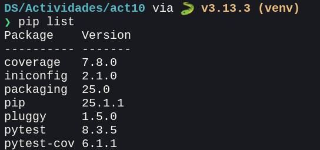
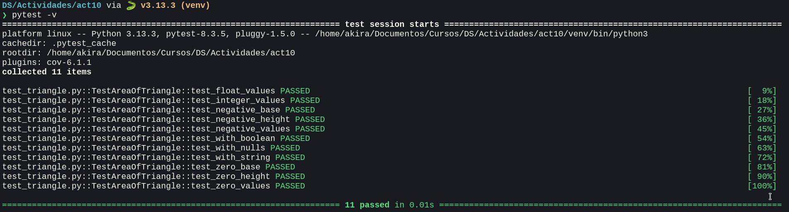
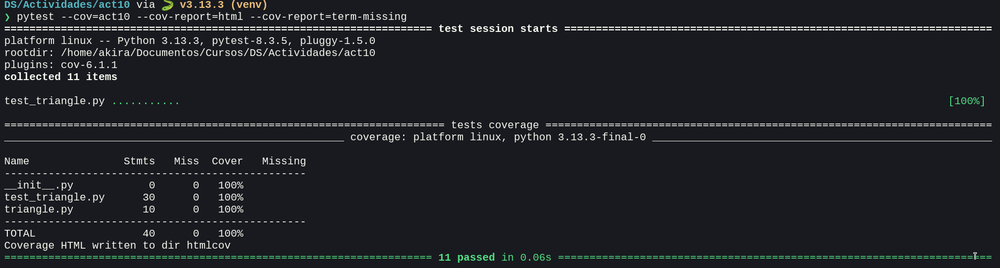
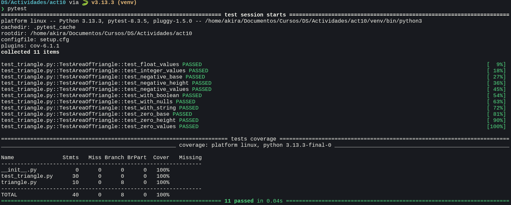

# Actividad 10

En esta actividad se realizaran diversas acciones con pytest y pytest-cov, dos librerías muy importantes en el desarrollo de software para verificar el correcto funcionamiento del código fuente y el uso completo de este.

## 1. Instalando pytest y pytest-cov

En un ambiente virtual, se instalan ambas librerías `pip`.



## 2. Ejecutando pruebas con pytest

Para ejecutar las pruebas de la actividad, solo es necesario ejecutar el comando `pytest`. Este automaticamente detecta todos los archivos que empiezan con el prefijo `test_` y ejecuta todas las funciones con el prefijo `test_`. La bandera `-v` indica *verbosidad*. Es decir, los resultados serán más detallados.

### Resultado



En este caso, todas las pruebas en `test_triangle.py` resultaron exitosas, indicado por la salida del comando como **PASSED**.

## 3. Cobertura de pruebas con pytest-cov

`pytest-cov` es un plugin de la librería `pytest` para realizar pruebas de cobertura. Es decir, verifica qué líneas no han sido ejecutadas al ejecutar las pruebas con `pytest`. Estas líneas pueden indicar que las pruebas no están verificando las características completas del software.

En esta actividad, se ejecutan las pruebas de cobertura con `pytest --cov=act10 --cov-report=html --cov-report=term-missing`. Este comando ejecuta las pruebas en el proyecto `act10`, genera un reporte en html y además reporta las líneas no cubiertas por las pruebas.

### Tests en el reporte de cobertura

Es importante resaltar que **los tests también son parte del reporte de cobertura**. Saltear la cobertura de los tests no es adecuado ya que ignoramos el hecho de que, como todo código, este puede contener lógica no utilizada u obsoleta que no se ejecute correctamente y necesita ser verificada, en especial en funciones *helper* que no son pruebas en si pero ayudan a su ejecución. Por lo tanto, se incluyen en las pruebas de cobertura.

Fuente: [You should include your tests in coverage](https://nedbatchelder.com/blog/202008/you_should_include_your_tests_in_coverage.html) 

### Resultado



El reporte en html está incluido junto a este informe.


## 5. Automatizando la configuración de pytest

El paso 4 es salteado. Para ahorrar tiempo al escribir comandos largos, se pueden definir la configuración de pytest en `pytest.ini` o `setup.cfg`.

### setup.cfg

Este archivo define configuraciones globales del proyecto, no solo para pytest, sino para paquetes como `flake8` o `mypy`.

### pytest.ini

Este archivo es específico para pytest, no configura otras herramientas como setup.cfg.

### En esta actividad

En nuestro caso, se usará un archivo simple `setup.cfg`.

```cfg
[tool:pytest]
addopts = -v --tb=short --cov=. --cov-report=term-missing

[coverage:run]
branch = True

[coverage:report]
show_missing = True
```

Este indica que `pytest` asuma las banderas especificadas sin escribirlas explícitamente. `coverage:run` y `coverage:report` especifican cómo `coverage.py` debería ser ejecutado y cómo debería generarse el reporte de cobertura, respectivamente.

## 6. Ejecutando pruebas con la configuración automatizada

### Resultado

Con la configuración usada, ejecutar `pytest` muestra el siguiente resultado.


