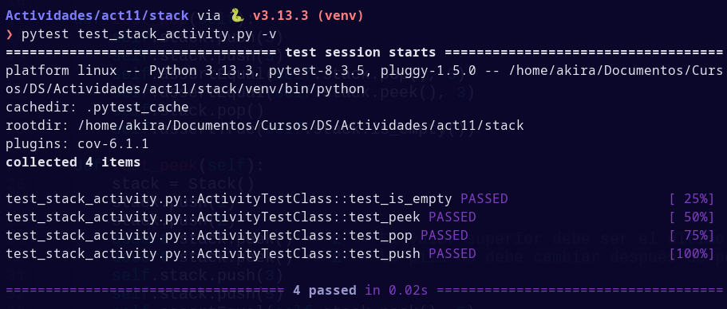

# Informe de actividad 11

En esta actividad se siguen buenas prácticas para aserciones en pruebas con `pytest`.

## 1. Instalación de pytest

Con la utilidad `pip`, se instala `pytest` y `pytest-cov`.

## 2. Archivos de prueba

El archivo de prueba de esta actividad es `test_stack.py`, que prueba las funcionalidades de `stack.py`. Este último implementa una estructura de datos de pila.

### Ejecución de `pytest`


### Aleatoridad en `pytest`

`pytest` por defecto efectúa los tests según se encuentran en los archivos de tests. Este comportamiento permite que las pruebas sean predecibles, pero puede que ignore casos de interdependencia de tests. La interdependencia de pruebas no es desable, ya que rompe con los principios de aislamiento (al hacer que las pruebas dependan entre ellas) y reusabilidad (al no permitir que una prueba no pueda ser usada en otro test sin sus dependencias). El plugin `pytest-randomly` carga los tests aleatoriamente, lo cual puede descubrir posibles casos de interdependencia.


## 3. Escribiendo aserciones

Genero un nuevo archivo de pruebas `test_stack_activity.py` para las pruebas provistas en las instrucciones. Se omite el código ya que está explícito en el archivo de instrucciones.

Primero, escribo pruebas para las funciones `is_empty()` y `pop()` y las ejecuto. Al igual que con el archivo `test_stack.py`, debo escribirlas dentro de una clase que hereda de `TestCase`.

### TestCase

`TestCase` es una clase de la librería de pruebas `unittest`, la cual provee una interfaz que permite la ejecución de tests y reporte de fallos. En esta actividad, se usan los métodos de la interfaz `setUp()` y `tearDown()`, los cuales se ejecutan antes y después de cada test, respectivamente.

Fuente: [unittest documentation](https://docs.python.org/3/library/unittest.html#unittest.TestCase) 


## 4. Ejecución de pruebas iniciales


## 5. Pruebas para el método `peek()`

Para esta prueba, combino las dos pruebas provistas en el archivo instrucciones.

### Ejecución de pruebas


## 6. Pruebas para el método `pop()`

Las pruebas son similares a las pruebas ya escritas para `pop()` anteriormente, por lo que se saltea este paso.

## 7. Pruebas para el método `push()`

Al igual que con las pruebas para `peek()`, junto las pruebas provistas en el archivo de instrucciones para formar una nueva prueba. Debido a que la lógica del programa es simple, puedo mezclar estos códigos y verificar su funcionamiento sencillamente.

## 8. Ejecución de pruebas



## 9. Cobertura con `pytest-cov`

Al igual que con la actividad anterior, se pueden generar pruebas de cobertura con `pytest-cov`.

### Ejecución de pruebas de cobertura


## setup.cfg

Al igual que con la actividad anterior, se ofrece un archivo `setup.cfg` con configuraciones para las utilidades `pytest` y `pytest-cov`. Después de aplicar las configuraciones sugeridas por el archivo de instrucciones, se tiene la siguiente configuración:

```cfg
[tool:pytest]
addopts = -v --tb=short --cov=stack --cov-report=term-missing

[coverage:run]
branch = True
omit =
   */tests/*
   */test_*

[coverage:report]
show_missing = True
```

Esto permite que ejecutar `pytest` se ejecuten automáticamente las banderas especificadas: verbosidad, pila de errores acortada y cobertura con líneas faltantes. Además, las pruebas de covertura se configuran para que se analicen condicionales en el código adecuadamente, se omitan los archivos de prueba (aunque no es recomendable) y además que el reporte de cobertura incluya las líneas de código no cubiertas.

### Ejecución de pruebas con archivo setup.cfg


