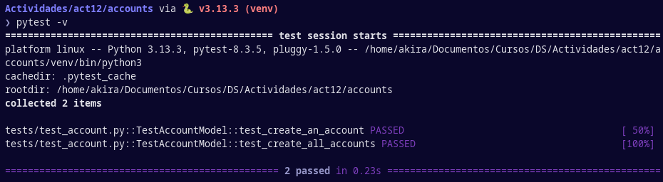

# Informe de Actividad 12

En esta actividad se usan *fixtures* para realizar acciones antes y después de ejecutar pruebas. 

Por lo general, quieres definir variables que se usen en cada pruebas, para evitar definirlas en cada prueba repetidas veces, y regresarlas a un estado inicial al finalizar cada prueba para mantener la independencia entre ellas. 

Por ejemplo, en una aplicación de correo, puedes verificar la funcionalidad de enviar correos creando un par de usuarios en una prueba y verificando que, cuando el primero le envíe un correo al segundo, este último tenga un correo en la bandeja de entrada. Sin embargo, si en tu siguiente prueba quieres verificar que el segundo usuario tenga una bandeja de entrada vacía por ser considerado un usuario nuevo, entonces habrá conflictos con la prueba anterior. Por este motivo, en este caso se querrá limpiar la bandeja de entrada de los usuarios antes de cada prueba.

Fuente: [How to use fixtures - pytest](https://docs.pytest.org/en/7.1.x/how-to/fixtures.html) 

## 1. Inicializar la base de datos:

En este primer fixture se establece que el escopo sea a nivel de módulo y que se use automática en cada prueba. La palabra reservada `yield` se usa como `return`, con la diferencia de que todo lo que está antes del yield se ejecuta antes de las pruebas, `yield` retorna un valor para las pruebas y todo lo que se encuentra después se ejecuta después de las pruebas. Es decir, se abre la conexión con la base de datos, se retorna y se cierra la conexión al finalizar la prueba. Esto aisla la ejecución de pruebas y su conexión con la base de datos.

```python
@pytest.fixture(scope="module", autouse=True)
def setup_database():
    """Configura la base de datos antes y después de todas las pruebas"""
    with app.app_context():
        db.create_all()
        yield
        db.session.remove()
        db.drop_all()
```

Por ser una aplicación en Flask, las pruebas necesitan especificarse que son ejecutadas en el contexto de la aplicación. Para esto, se usa `app.app_context()` tanto en las fixtures como en las pruebas.

## 2. Cargar datos de prueba

Se usarán datos de pruebas para ejecutar las pruebas. Para esto, el archivo de tests debe cargar estos datos y usarlos en cada una de las pruebas como sea necesario.

```python
class TestAccountModel:
    """Modelo de Pruebas de Cuenta"""

    @classmethod
    def setup_class(cls):
        """Cargar los datos necesarios para las pruebas"""
        global ACCOUNT_DATA
        with open('tests/fixtures/account_data.json') as json_data:
            ACCOUNT_DATA = json.load(json_data)
        print(f"ACCOUNT_DATA cargado: {ACCOUNT_DATA}")
```

Se usa el decorador `@classmethod` para definir un fixture dentro de la clase de pruebas. En este caso, se cargan los datos de `account_data.json` una vez antes de ejecutar cada test al instanciar la clase.

## 3. Crear una cuenta

Usando los datos de prueba y la conexión a la base de datos, se puede empezar a probar las características de `Account`. En primer lugar, se intenta creando una cuenta de la lista de cuentas de prueba.

```python
def test_create_an_account(self):
    """Probar la creación de una sola cuenta"""
    data = ACCOUNT_DATA[0]
    with app.app_context():
        account = Account(**data)
        account.create()
        assert len(Account.all()) == 1
```

Al igual que con el código para iniciar la conexión a la base de datos, este código se usa en el contexto de la aplicación, por lo que requiere `with app.app_context()`.

## 4. Crear todas las cuentas

De forma similar a la prueba anterior, se pueden crear todas las cuentas en el archivo de cuentas de pruebas.

```python
def test_create_all_accounts(self):
    """Probar la creación de múltiples cuentas"""
    with app.app_context():
        for data in ACCOUNT_DATA:
            account = Account(**data)
            account.create()
        assert len(Account.all()) == len(ACCOUNT_DATA)
```

## 5. Limpiar tablas antes y después de cada prueba

Para evitar que las interacciones con la base de datos de una prueba afecten con las interacciones de otra prueba, se debe limpiar la base de datos antes y después de cada prueba.

```python
def setup_method(self):
    """Truncar las tablas antes de cada prueba"""
    with app.app_context():
        db.session.query(Account).delete()
        db.session.commit()

def teardown_method(self):
    """Eliminar la sesión después de cada prueba"""
    with app.app_context():
        db.session.remove()
```

El método `setup_method()` elimina las filas de la tabla, asegurando que la tabla esté vacía al inicio de cada prueba. El método `teardown_method()` elimina la sesión después de cada prueba, asegurando que cualquier cambio sin confirmar se descarte y se remueva la conexión.

## 6. Ejecución de pytest final



## Conclusión final de fixtures

Todos los fixtures escritos fueron necesarios para dos pruebas, lo cual demuestra lo importante que son para escribir tests en aplicaciones cada vez más complejas, como lo es una aplicación en Flask. Los fixtures de clases, de pruebas y de base de datos aseguran que cada prueba se mantenga aislada y determinista. Es decir, no dependerá de otras pruebas y su resultado siempre será consistente.
