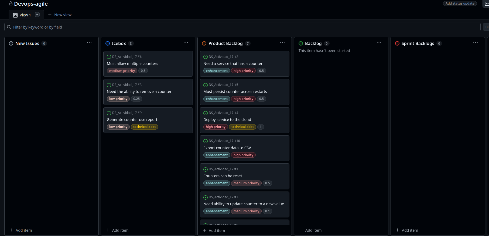
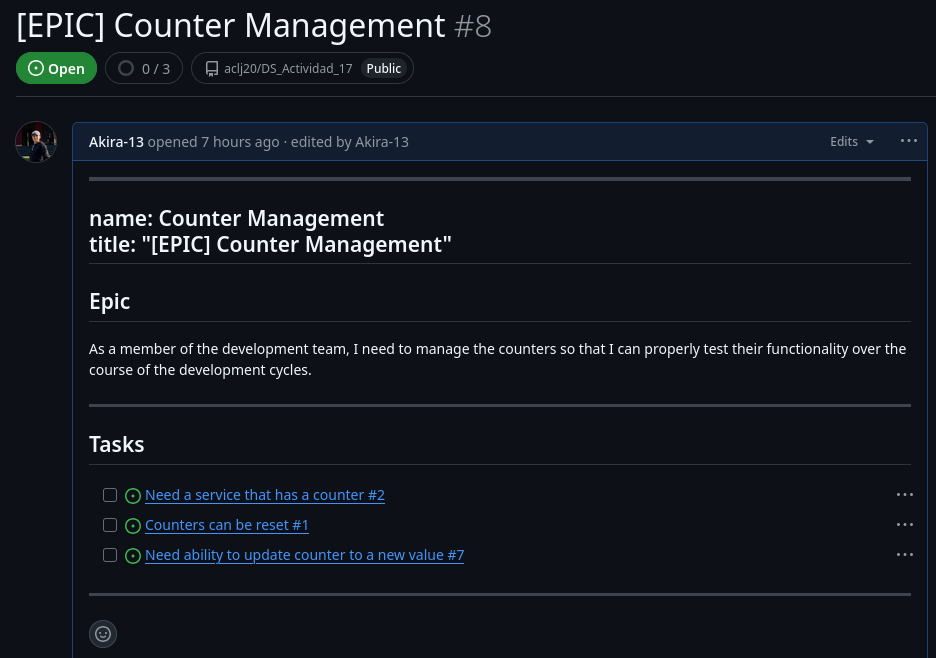
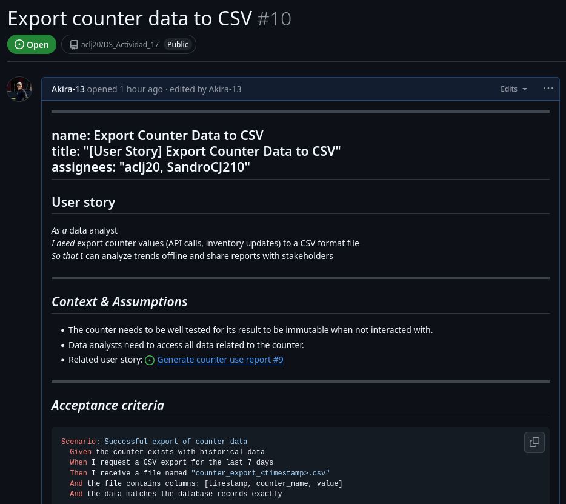

# Informe de actividad 17

## Enlace al repositorio

https://github.com/aclj20/DS_Actividad_17

## Objetivos

- Aprender el funcionamiento del tablero Kanban en GitHub Projects para el desarrollo basado en Sprints.
- Organizar un proyecto simple alrededor de issues de GitHub.
- Usar *templates* para crear issues en forma de historias de usuario.
- Implementar el tablero Kanban en el flujo CI para su automatización.
- Usar *epics* para definir objetivos a largo plazo e incluir objetivos a corto plazo en este.

## Tablero Kanban final

## Conceptos trabajados

### Epics

- Las épicas o *epics* son objetivos que pueden ser divididos en tareas más pequeñas según los requerimientos de los clientes o usuarios finales.
- Las épicas son esenciales en el desarrollo Ágil. Representan la prioridad más alta en el trabajo de los desarrolladores y dan un contexto claro de las tareas individuales a realizar.

#### Epics de la actividad

Se desarrolló un epic **Counter Management** con diversas tareas hijo. Cuando estas se completen, el epic se considera completado.

### Product Backlog

- El *product backlog* es el log de tareas en donde se especifican las tareas propuestas por el *product owner*. Es decir, son las tareas enfocadas a brindar el mayor valor al producto en cada iteración según los requerimientos del cliente.
- El *product owner* es el encargado de enfocar los esfuerzos del equipo de desarrollo a brindar valor al producto. Es decir, se asegura que las tareas cumplan con los requerimientos de los stakeholders, clientes o usuarios finales.
- En esta actividad, asumí el rol de *product owner* en el ejercicio 5. En este ejercicio, se me ofrece una nueva característica propuesta por los stakeholders, la cual debo implementar en el *product backlog* mediante *backlog refinement*.
- Como su nombre lo indica, el *backlog refinement* es el proceso de refinar el backlog: actualizar prioridades, cambiar historias de usuario, quitar o agregar tareas, etc.
- En mi caso, tuve que acomodar la prioridad de la nueva tarea *Export counter data to CSV* en comparación a las demás tareas.
- Además, se agregaron criterios de aceptación en forma de historias *given-when-then* para que la tarea forme parte de un sprint completo.

#### Tarea en el tablero

