# Tabla de contenidos

1.  [Parte 1: git rebase para mantener un historial lineal](#orgbc5caaa)
    1.  [Rama inicial](#orga3b18b0)
    2.  [Rama new-feature](#org09f2504)
    3.  [git rebase y merge](#orge4a61b8)
        1.  [Rebase](#org9a4a06e)
        2.  [Merge](#orgdaf8d3c)
2.  [Parte 2: git cherry-pick para la integración selectiva de commit](#org2a240b1)
    1.  [Diagrama de ramas](#org6d5a535)
    2.  [Cherry-pick](#orgda25e53)
    3.  [Preguntas de discusión](#org45b8fba)
3.  [Ejercicios Teóricos](#orga208616)
4.  [Ejercicios prácticos](#org36c957d)
5.  [Git, Scrum y Sprints](#org5710cd9)
    1.  [Fase 1: Planificación del sprint (sprint planning)](#orgd6f8434)
        1.  [Ejercicio 1: Crear ramas de funcionalidades (feature branches)](#org117e6a9)
    2.  [Fase 2: Desarrollo del sprint (sprint execution)](#org9b00752)
        1.  [Ejercicio 2: Integración continua con git rebase](#org0f307e4)
    3.  [Fase 3: Revisión del sprint (sprint review)](#org9b63802)
        1.  [Ejercicio 3: Integración selectiva con git cherry-pick](#org99acda5)
    4.  [Fase 4: Retrospectiva del sprint (sprint retrospective)](#org290fe7d)
        1.  [Ejercicio 4: Revisión de conflictos y resolución](#org345c435)
    5.  [Fase 5: Fase de desarrollo, automatización de integración continua (CI) con git rebase](#orgdca9680)
        1.  [Ejercicio 5: Automatización de rebase con hooks de Git](#orgbab3088)
    6.  [Navegando conflictos y versionado en un entorno DevOps](#orgd8eb8ed)
6.  [Preguntas](#orge2e932d)

# Parte 1: git rebase para mantener un historial lineal

## Rama inicial

Después de crear el repositorio `prueba-git-rebase` y realizar los commits correspondientes, así se ve el gráfico en la rama `main`.

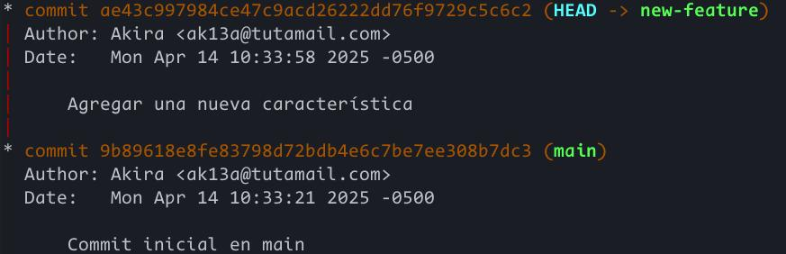

## Rama new-feature

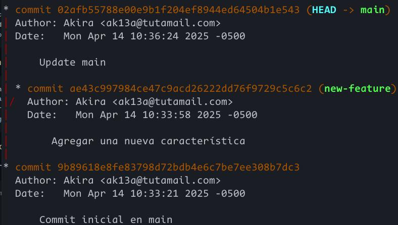

## git rebase y merge

### Rebase

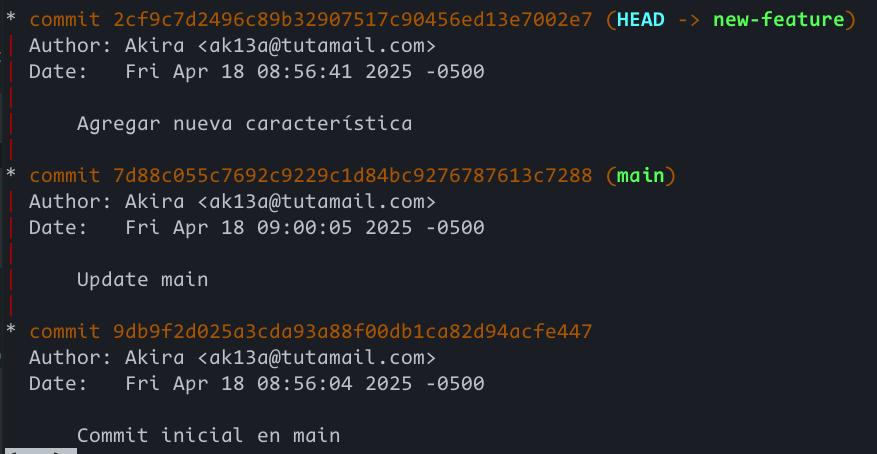

### Merge

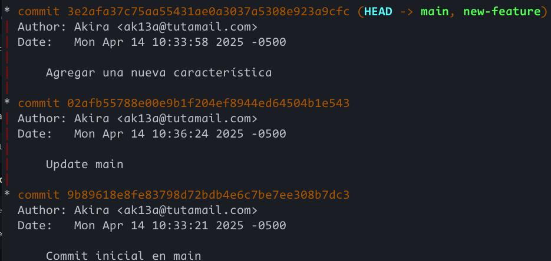

# Parte 2: git cherry-pick para la integración selectiva de commit

Después de la inicialización del segundo repositorio y creación de la rama `add-base-documents`, así se ve el gráfico del repositorio:

[Gráfico inicial del segundo repositorio](../resources/img/A6_P2_1.jpg)

## Diagrama de ramas

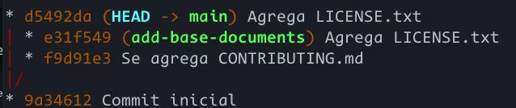

## Cherry-pick

Realizando un cherry pick en el commit `db5e7b7` a la rama principal, se tiene el siguiente gráfico:

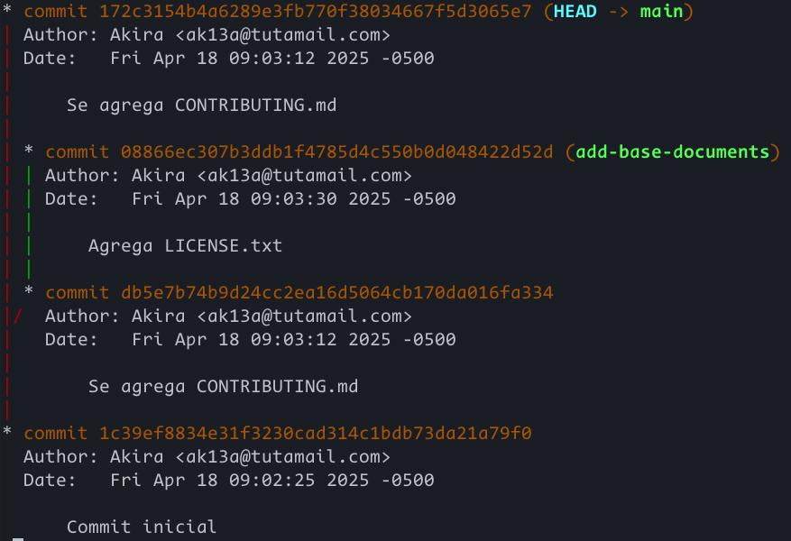

Este nuevo commit tiene un hash diferente al de &ldquo;Se agrega CONTRIBUTING.md&rdquo; de la rama `add-base-documents`.

## Preguntas de discusión

1.  **¿Por qué se considera que rebase es más útil para mantener un historial de proyecto lineal en comparación con merge?**
    
    Porque puedes ir desde el inicio del proyecto hasta el último commit de forma lineal tras realizar un `git rebase`. Con `git merge`, en cambio, las ramas se mantienen sin modificar e incluso se crea un commit adicional, lo cual puede resultar en un historial con varias bifurcaciones.
    
    Fuentes:
    
    -   [Merging vs. Rebasing | Atlassian Git Tutorial](https://www.atlassian.com/git/tutorials/merging-vs-rebasing)
2.  **¿Qué problemas potenciales pueden surgir si haces rebase en una rama compartida con otros miembros del equipo?**
    
    `git rebase` reescribe la historia de una rama. No solo &ldquo;mueve&rdquo; los commits de una rama, sino que los reescribe con un hash diferente, por lo que son commits diferentes a los originales. En una rama pública en la que varios están colaborando, esto resulta en problemas de coordinación ya que gran parte de tu historia diferirá del repositorio público. Esto se haría incluso peor si es que empujas esta nueva historia, ya que el progreso de los demás desarrolladores podrían depender de commits que técnicamente ya no existen.
    
    Fuentes:
    
    -   [git rebase | Atlassian Git Tutorial](https://www.atlassian.com/git/tutorials/rewriting-history/git-rebase)
3.  **¿En qué se diferencia cherry-pick de merge, y en qué situaciones preferirías uno sobre el otro?**
    
    `cherry-pick` solo aplica un commit específico de la historia de una rama como último commit de otra. No modifica la historia de ninguna de las ramas y se genera un nuevo commit. `git rebase`, en cambio, reescribe varios commits sobre otra rama, modificando la historia de estos en el proceso.
    
    Fuentes:
    
    -   [Merging vs. Rebasing | Atlassian Git Tutorial](https://www.atlassian.com/git/tutorials/merging-vs-rebasing)
    -   [Git Cherry Pick | Atlassian Git Tutorial](https://www.atlassian.com/git/tutorials/cherry-pick)

# Ejercicios Teóricos

1.  **¿Cómo crees que el uso de git rebase ayuda a mejorar las prácticas de DevOps, especialmente en la implementación continua (CI/CD)? Discute los beneficios de mantener un historial lineal en el contexto de una entrega continua de código y la automatización de pipelines.**
    
    Un historial lineal permite una fácil recorrido de tu lista de commits en el contexto de colaboración continua. Cuando se realizan PRs en un repositorio, todos necesitan ver los commits que realizaste y un historial lineal será más fácil que un historial entre ramas. Además, si trabajas colaborativamente con otro desarrollador en la misma rama, el trabajo de este puede diferir del tuyo. Para solucionar esto, puedes hacer una fusión entre tu rama local y la del desarrollador o simplemente aplicar los cambios que realizaste sobre los del otro desarrollador con `git rebase`, lo cual resulta más intuitivo.
    
    Para la automatización de pipelines, usar `git rebase` antes de un merge a main asegura que tus cambios pueden ser aplicados sin problemas y reduce conflictos de merging en el futuro al tener tu rama actualizada con la principal.
    
    Fuentes:
    
    -   [Merging vs. Rebasing | Atlassian Git Tutorial](https://www.atlassian.com/git/tutorials/merging-vs-rebasing)
    -   [Squash, Rebase, Merge: Keeping Your CI/CD Pipelines Clean and Efficient 🚀 - D&#x2026;](https://dev.to/favxlaw/squash-rebase-merge-keeping-your-cicd-pipelines-clean-and-efficient-8cc)
2.  **Un equipo Scrum ha finalizado un sprint, pero durante la integración final a la rama principal (main) descubren que solo algunos commits específicos de la rama de una funcionalidad deben aplicarse a producción. ¿Cómo podría ayudar git cherry-pick en este caso? Explica los beneficios y posibles complicaciones.**
    
    `git cherry-pick` ayuda precisamente en los escenarios en los que solo se requieren algunos commits de otra rama. En lugar de tener que realizar un merge o rebase, solo pueden elegir las funcionalidades que necesitan. De igual modo, esto puede permitir pruebas aisladas en donde solo se testean commits específicos o por error se puede hacer un commit en una rama equivocada, por lo que solo se necesita hacer `git cherry pick` en la rama correcta. Sin embargo, también puede producir escenarios en donde se duplican commits, como por ejemplo tratar de hacer `git cherry pick` después de un merge. Por lo tanto, se debe tener bastante cuidado al usar esta herramienta en bases de código grandes.
    
    Fuentes:
    
    -   [Git Cherry-Pick: How to Select and Apply Specific Commits | DataCamp](https://www.datacamp.com/tutorial/git-cherry-pick)
    -   [Git Cherry Pick | Atlassian Git Tutorial](https://www.atlassian.com/git/tutorials/cherry-pick)

# Ejercicios prácticos

1.  **Simulación de un flujo de trabajo Scrum con git rebase y git merge**
    
    Después de crear el repositorio y los commits iniciales, el gráfico de commits se ve así:
    
    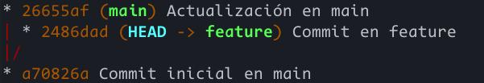
    
    -   **¿Qué sucede con el historial de commits después del rebase?**
        
        El historial se vuelve lineal.
        
        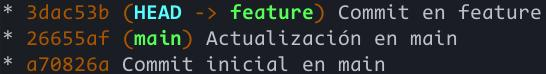
        
        Después de `git-merge --ff-only`, se tiene el siguiente grafo:
        
        
    
    -   **¿En qué situación aplicarías una fusión fast-forward en un proyecto ágil?**
        
        Cuando se requiran de cambios pequeños, como *hotfixes*, se pueden usar fusiones fast-forward para tener un historial de commits lineal rápidamente. Fusiones no-fast-forward son más útiles cuando se tienen demasiados cambios y se requiera una visión clara entre dos ramas distintas.

2.  **Cherry-pick para integración selectiva en un pipeline CI/CD**
    
    Despúes de la creación del repositorio, los commits y los cherry-picking, se tiene el siguiente gráfico en los que seralizaron dos cherry-pick.
    
    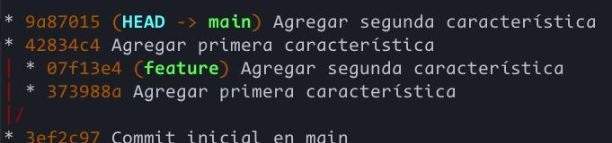
    
    -   **¿Cómo utilizarías cherry-pick en un pipeline de CI/CD para mover solo ciertos cambios listos a producción?**
        
        Cherry-picking serviría en estos casos para pasar a testeo solo algunos commits, como los que implementen funciones importantes, y aislar qué commits podrían introducir errores. Esto sería más difícil con un merge o rebase completo en donde todos los commits serían parte del pipeline desde un inicio.
    
    -   **¿Qué ventajas ofrece cherry-pick en un flujo de trabajo de DevOps?**
        
        Al igual que en la pregunta anterior, cherry-picking permite el desarrollo y despliege continuo al realizar cambios pequeños y estables que permiten testear cambios mínimos pero acumulables. Esto mantiene el ciclo de DevOps por permitir tener una base de código estable y testeada de manera rápida.

# Git, Scrum y Sprints

## Fase 1: Planificación del sprint (sprint planning)

### Ejercicio 1: Crear ramas de funcionalidades (feature branches)

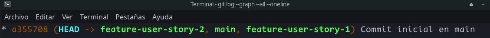

-   **¿Por qué es importante trabajar en ramas de funcionalidades separadas durante un sprint?**
    
    Permite aislar el código de las funcionalidades. Esto elimina el riesgo de conflictos al trabajar colaborativamente y realizar pruebas aisladas por funcionalidad en lugar de varias a la vez.

## Fase 2: Desarrollo del sprint (sprint execution)

### Ejercicio 2: Integración continua con git rebase

[title](../resources/img/A6_scrum_2_1.jpg)

-   **¿Qué ventajas proporciona el rebase durante el desarrollo de un sprint en términos de integración continua?**
    
    Con `git-rebase` te aseguras de que la rama en la que estés trabajando se mantenga al día con los últimos cambios de la rama base, por lo que, además de asegurar que tu rama no esté desactualizada, cuando se realice una fusión a esta última se reducirán los conflictos de fusión.

## Fase 3: Revisión del sprint (sprint review)

### Ejercicio 3: Integración selectiva con git cherry-pick

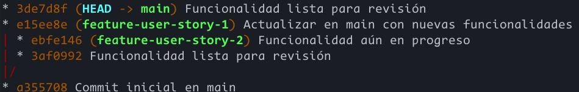

-   **¿Cómo ayuda \`git cherry-pick\` a mostrar avances de forma selectiva en un sprint review?**
    
    Con `git cherry-pick` puedes elegir solo los avances más importantes en la rama principal cuando la rama de desarrollo es demasiado larga y tiene commits que no son relevantes para revisión.

## Fase 4: Retrospectiva del sprint (sprint retrospective)

### Ejercicio 4: Revisión de conflictos y resolución

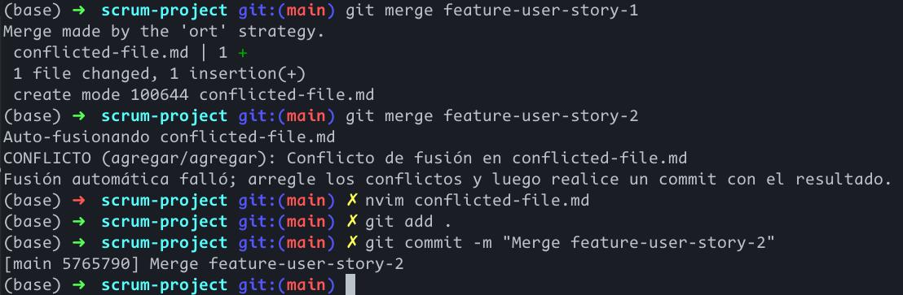

-   **¿Cómo manejas los conflictos de fusión al final de un sprint? ¿Cómo puede el equipo mejorar la comunicación para evitar conflictos grandes?**
    
    Los conflictos de fusión deben discutirse en grupo para hallar una solución que mantenga las funcionalidades necesarias y que cumpla con estándares establecidos según los pipelines de pruebas. Para evitar estos problemas, es importante que los miembros comuniquen entre si los cambios importantes que van a realizar a los archivos del repositorio compartido. De igual modo, PRs pequeños ayudan a evitar conflictos grandes en varios archivos y entre múltiples desarrolladores.

## Fase 5: Fase de desarrollo, automatización de integración continua (CI) con git rebase

### Ejercicio 5: Automatización de rebase con hooks de Git

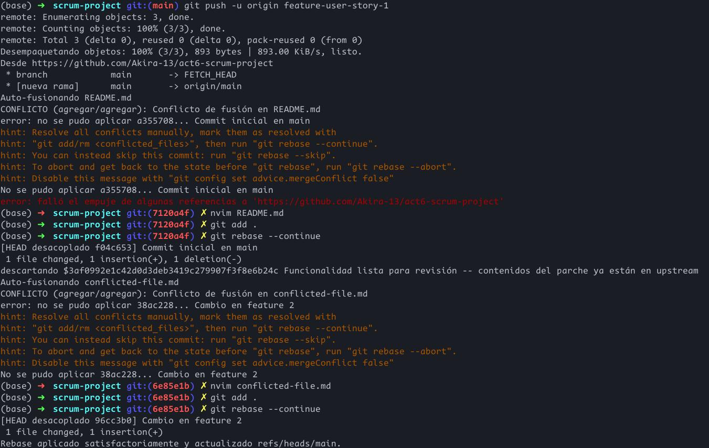

-   **¿Qué ventajas y desventajas observas al automatizar el rebase en un entorno de CI/CD?**
    
    Automatizar el rebase permite el manejo constante de conflictos constantes con la rama principal. Esto reduce los riesgos futuros al realizar fusiones. Sin embargo, esto mueve la responsabilidad de resolver conflictos en un desarrollador en lugar de que sea un trabajo colaborativo.

## Navegando conflictos y versionado en un entorno DevOps

1.  **Inicialización del proyecto y creación de ramas**
    
    Después de inicalizar el proyecto y realizar unos commits iniciales, se tiene el siguiente gráfico
    
    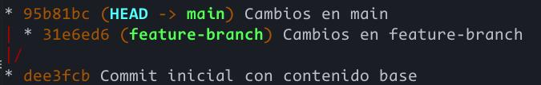

2.  **Fusión y recolección de conflictos**
    
    Al realizar `git-merge` y luego `git checkout --ours` en `archivo_colaborativo.txt`, como en la siguiente imagen, se tiene el grafo que sigue.
    
    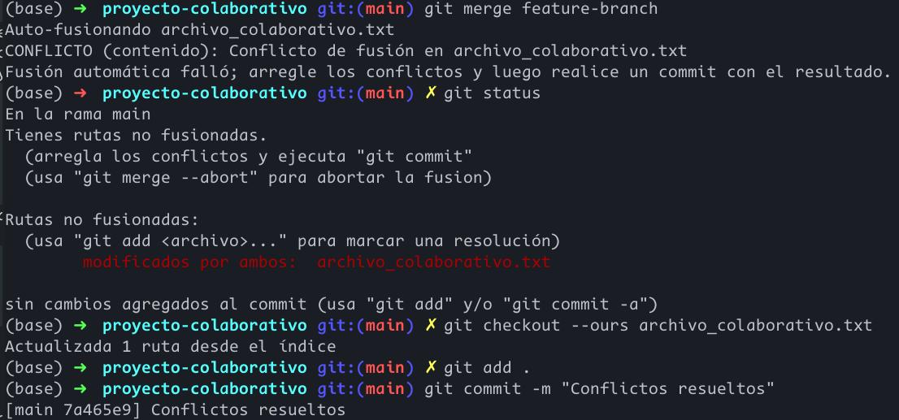
    
    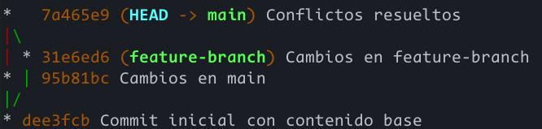

3.  **Simulación de fusiones y uso de git diff**
    
    Después de agregar cambios para simular, el grafo termina así:
    
    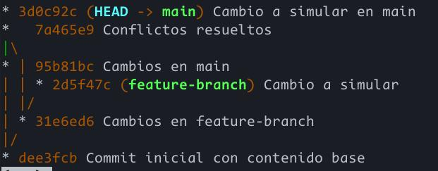
    
    Simulando una fusión y revisando los archivos en conflictos:
    
    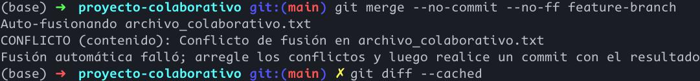
    
    

4.  **Uso de git mergetool**
    
    Utilizando vimdiff como herramienta para solucionar conflictos, se tiene el siguiente resultado:
    
    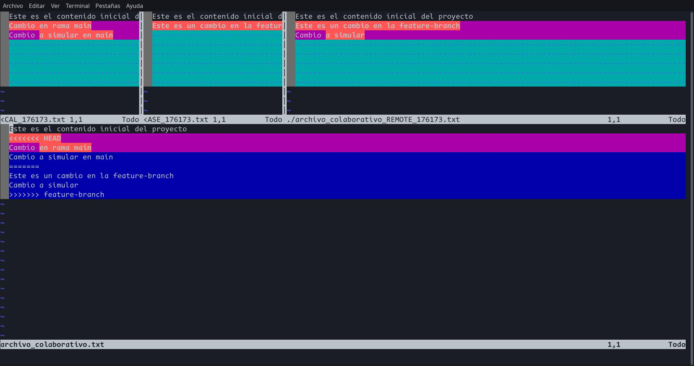
    
    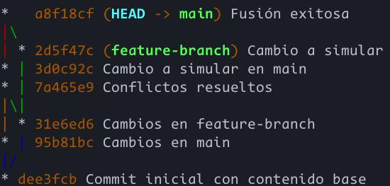

5.  **Uso de git revert y git reset**
    
    Primero, creo un commit &ldquo;erróneo&rdquo;:
    
    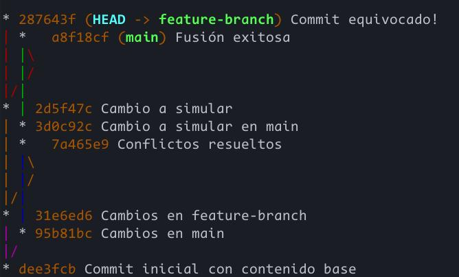
    
    -   Utilizando `git revert`
        
        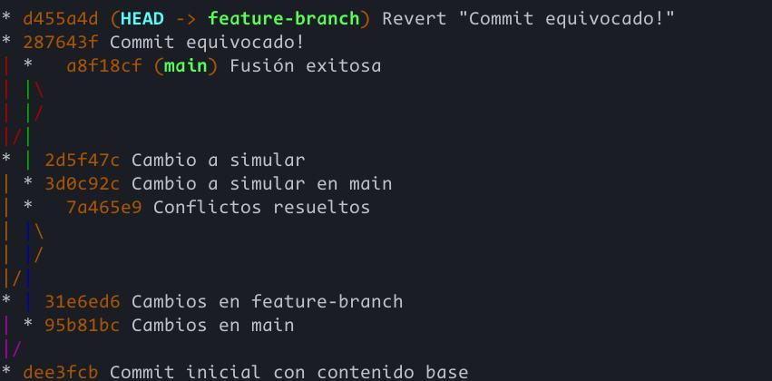
    
    -   Utilizando `git reset --mixed`, primero necesito cambios en staging pero sin cometer. Después del reset, estos cambios se quitan del área de staging y el índice apunta al commit al que se hace reset.
        
        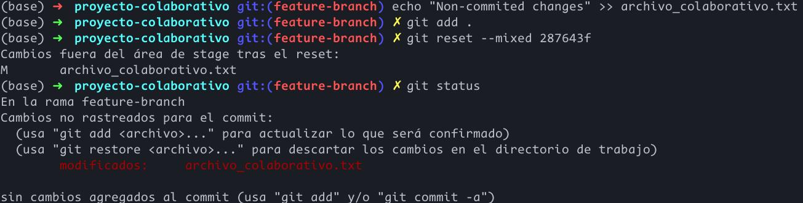

6.  **Versionado semántico y etiquetado**
    
    Después de etiquetar el último commit, se tiene el siguiente grafo:
    
    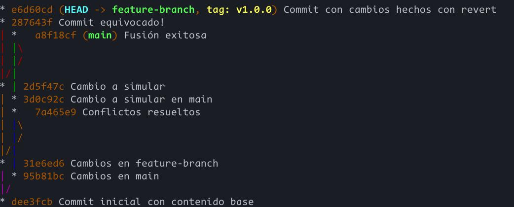

7.  **Aplicación de git bisect para depuración**
    
    Se usa de forma básica `git bisect` para aislar el commit &ldquo;erróneo&rdquo;.
    
    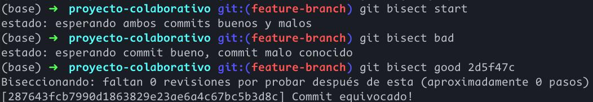

8.  **Documentación y reflexión**
    -   Se documentó todos los comandos utilizados.
    
    -   **Documentación**
        1.  La resolución de conflictos con la fusión, ya sea de forma manual o con alguna mergetool, fomenta la colaboración entre diversos miembros entre equipos, ya que algunos cambios podrían irrumpir con cambios introducidos por otros. De igual modo, esto promueve la fusión constante para reducir el riesgo de conflictos grandes. Las mergetools en este contexto son importantes para facilitar el trabajo de resolución de conflictos, el cual puede extenderse entre varios archivos. Finalmente, la fusión simulada también ayuda a detectar conflictos mucho antes de que interfieran con la rama principal.
        
        2.  `revert` es especialmente útil para no modificar el historial de commits. En un contexto de alta colaboración y comunicación, borrar commits puede resultar en ramas no sincronizadas entre varios miembros y equipos, por lo que realizar commits explícitos de corrección permite una mayor transparencia entre colaboradores. Aunque `reset` no sea recomendado, puede ser útil en ramas locales.
        
        3.  `bisect` agiliza la identificación de errores introducidos por commits. En el contexto de DevOps, esto facilita el despliegue continuo al aislar errores, corregirlos y regresar a un código funcional que pase por las pruebas necesarias.
        
        4.  Finalmente, el tagging permite hacer públicos los hitos más importantes en el código. Para el desarrollo e integración continuos, marcar claramente el desarrollo en los commits permite evaluar el progreso del grupo e identificar las características añadidas en cada momento. Cuando se tiene un buen sistema de versionado, los grupos pueden revisar su progreso y asegurarse de estar al día con la última version del código.

# Preguntas

1.  **Ejercicio para git checkout &#x2013;ours y git checkout &#x2013;theirs**
    -   Si el equipo A quiere conservar sus cambios, simplemente usaría `git checkout --theirs` cuando cambie a la rama principal y fusione. Si el equipo B prefiere los cambios de A y fusionarlos a su rama, usaría `git checkout --theirs` en su propia rama. Como ambos quieren mantener sus propios cambios, se espera que alguno fusione con `git checkout --theris` sobre la rama principal.
    -   Dependiendo de los cambios y conflictos introducidos, ambos comandos pueden ser útiles. `--ours` permite mantener el código de la rama principal, por lo que reduciría posibles conflictos con otros miembros que trabajen sobre esta rama como referencia. Igualmente, al usar código que ya pasó por pruebas, se supera el pipeline CI/CD más fácilmente. Una vez superado el conflicto, el pipeline se reanuda y se ejecutan las pruebas necesarias. `--theirs` tiene el uso opuesto y puede servir para corregir código en la rama principal con el código escrito en la rama desarrollada.
    -   La calidad se asegura con las pruebas implementadas en el pipeline CI/CD y con la revisión manual del código. Si alguna versión claramente realiza cambios destructivos en el código base, la elección será obvia, pero dependerá de las pruebas asegurar que algún código sea el adecuado.

2.  **Ejercicio para git diff**
    -   `git diff` permite identificar cambios en archivos modificados. `git diff feature-branch..main`, en particular, compara los cambios introducidos por la rama feature-branch sobre main.
    
    -   Se pueden señalar qué archivos comparar entre ramas con argumentos adicionales en `git diff`, como por ejemplo `git diff feature-branch..main configuracion.yml`.
    
    -   Comparar cambios entre ramas es esencial, ya que esto permite decidir qué cambios introducir o no sobre una rama importante o compartida. Si es que algunos cambios introducen errores o modifican configuraciones importantes, es importante identificar estos cambios antes de que sean introducidos. Con esto, se mantiene la estabilidad del pipeline y de las ramas compartidas.

3.  **Ejercicio para git merge &#x2013;no-commit &#x2013;no-ff**
    -   Usar `git merge --no-commit --no-ff` implica actualizar mi rama local con la remota y luego utilizar este comando para simular una fusión en mi entorno local.
    
    -   En un flujo de trabajo ágil, esta práctica evita errores antes de que sean introducidos por una fusión. Además, permite probar el código localmente sin que se fusione a la rama remota, lo cual reduce conflictos futuros y problemas en el código.
    
    -   En una pipeline, usaría un archivo de configuración, por ejemplo uno para GitHub Actions, el cual realice fusiones simuladas automáticamente y ejecute pruebas automatizadas. En caso de error, el pipeline se detendría y reportaría sus resultados, lo cual ahorra tiempo de ejecución de la fusión simulada.

4.  **Ejercicio para git mergetool**
    -   Usaría `git config --global merge.tool vimdiff`. En mi caso, estoy cómodo usando Vim, por lo que prefiero usar esta herramienta en particular. Al hacer un `merge` con conflictos, puedo llamar a `git mergetool` para utilizar vimdiff y solucionar los conflcitos de forma visual.
    
    -   Las herramientas visuales aceleran el proceso de reconocer diferencias entre archivos, además de reducir errores humanos. Sin embargo, cada miembro debe saber manejar estar herramientas y a veces podrían no estar disponibles las herramientas preferidas de cada miembro.
    
    -   Para que los miembros tengan consistencia, todos tendrían que usar las mismas herramientas con las mismas configuraciones. Esto puede ser fácil para herramientas básicas, pero en el caso de herramientas más especializadas, cada uno puede tener preferencias de configuraciones específicas. En su defecto, usar VSCode sería ideal, ya que cada uno podría tener sus propias extensiones o configuraciones personales sin afectar estándares grupales. Además, el flujo CI/CD podría verificar que la resolución de conflictos sea válida y estandarizada entre miembros y equipos.

5.  **Ejercicio para git reset**
    -   `git reset --soft`: Mueve el HEAD al commit especificado pero mantiene cualquier cambio en el área de staging
    
    -   `git reset --mixed`: Mueve el HEAD al commit especificado y quita los cambios hechos del área de staging.
    
    -   `git reset --hard`: Mueve el head al commit especificado y reinicia completamente el estado del directorio de trabajo al de este

6.  **Ejercicio para git revert**
    -   `git revert` permite rehacer un commit con otro que revierta los cambios introducidos por este. Esto es más seguro para el pipeline, ya que no reescribe el historial de commits ni forzar empujes.
    
    -   Para asegurar que esta acción no afecte el pipeline se deben revertir commits que introduzcan errores, los cuales pueden identificarse con `git bisect`, y constantemente comparar con `git diff` los cambios introducidos para asegurarte de no romper la base de código.
    
    -   `git revert` permite revertir un rango de commits haciendo `git revert <commit inicial>..<commit final>`. Para verificar introducir cambios desastrozos, se pasa la bandera `--no-commit` para verificar todos los cambios hechos con el nuevo commit de reversión.

7.  **Ejercicio para git stash**
    -   Primero, llamaría a `git stash push` para guardar mis cambios sin commitear, cambiaría a la rama que requiere de trabajo inmediatamente y, cuando termine, regresaría a mi rama de trabajo y aplicaría mis cambios nuevamente con `git stash pop`.
    
    -   `git stash` evita aplicar commits con cambios en progreso o incompletos, los cuales podrían romper con el flujo del pipeline. Además, como en el caso anterior, este permite trabajar en ramas que requieren de atención inmediata sin descartar cambios en los que se esté trabajando.

8.  **Ejercicio para .gitignore**
    -   El `.gitignore` necesita abarcar todas las extensiones de configuraciones personales y logs en los repositorios locales de todos los desarrolladores y todos los equipos. Un ejemplo podría ser:
        
            *.git
            *.yml
            *.env
    
    -   El archivo `.gitignore` debe ser compartido por todos los desarrolladores para evitar que algún archivo secreto, de configuración personal, o en general cualquiera que no debería ser público sea empujado a la rama compartida. Caso contrario, este podría pasar desapercibido a lo largo de varios commits y contaminar una rama a través de su historia. En el peor caso, cuando un archivo con secretos es empujado, este es un riesgo de seguridad grave.

