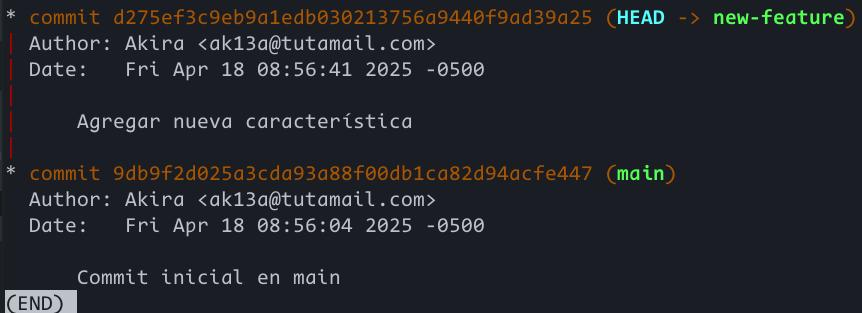
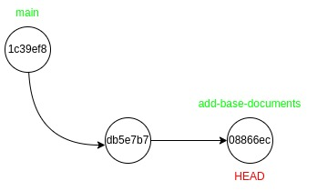

# Tabla de contenidos

1.  [Parte 1: git rebase para mantener un historial lineal](#org5f48d9b)
    1.  [Rama inicial](#org983eb56)
    2.  [Rama new-feature](#org6305f88)
    3.  [git rebase y merge](#orgf90143a)
        1.  [Rebase](#org4240aba)
        2.  [Merge](#orgcaa07b6)
2.  [Parte 2: git cherry-pick para la integración selectiva de commit](#orgf440f23)
    1.  [Diagrama de ramas](#orgf658abf)
    2.  [Cherry-pick](#orgc4f83e7)

# Parte 1: git rebase para mantener un historial lineal

## Rama inicial

Después de crear el repositorio `prueba-git-rebase` y realizar los commits correspondientes, así se ve el gráfico en la rama `main`.

## Rama new-feature

## git rebase y merge

### Rebase

### Merge

# Parte 2: git cherry-pick para la integración selectiva de commit

Después de la inicialización del segundo repositorio y creación de la rama `add-base-documents`, así se ve el gráfico del repositorio:

## Diagrama de ramas

## Cherry-pick

Realizando un cherry pick en el commit `db5e7b7` a la rama principal, se tiene el siguiente gráfico:

Este nuevo commit tiene un hash diferente al de &ldquo;Se agrega CONTRIBUTING.md&rdquo; de la rama `add-base-documents`.

