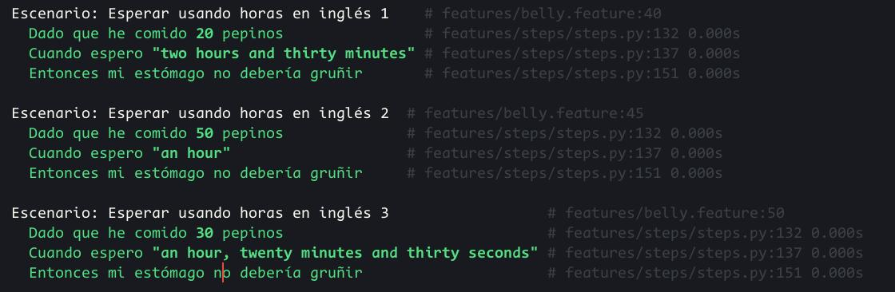

# Informe de la actividad 7

## Ejercicio 1

### steps.py

Solo se debe adaptar la exprexión regular y calcular los segundos con las funciones dadas. Toda la expresión la muevo a una nueva función.

```python
def convert_description_to_hours(time_description):
    time_description = time_description.strip('"').lower()
    time_description = time_description.replace("y", " ")
    time_description = time_description.strip()

    if time_description == "media hora":
        total_time_in_hours = 0.5
    else:
        pattern = re.compile(
            r"(?:(\w+)\s*horas?)?\s*(?:(\w+)\s*minutos?)?\s*(?:(\w+)\s*segundos?)?"
        )
        match = pattern.match(time_description)

        if match:
            hours_word = match.group(1) or "0"
            minutes_word = match.group(2) or "0"
            seconds_word = match.group(3) or "0"

            hours = convertir_palabra_a_numero(hours_word)
            minutes = convertir_palabra_a_numero(minutes_word)
            seconds = convertir_palabra_a_numero(seconds_word)

            total_time_in_hours = hours + (minutes / 60) + (seconds / 3600)
        else:
            raise ValueError(
                f"No se pudo interpretar la descripción del tiempo: {time_description}"
            )
    return total_time_in_hours
```

### belly.feature

Implemento un escenario en belly.feature que use segundos.

```gherkin
  Escenario: Comer pepinos y esperar en horas, segundos y minutos
    Dado que he comido 25 pepinos
    Cuando espero "una hora, treinta minutos y veinte segundos"
    Entonces mi estómago debería gruñir
```

### Pytest

Implemento algunas pruebas básicas para verificar que se interpreten segundos adecuadamente. Las pruebas son superadas sin problema.

```python
def test_convert_seconds_to_hours():
    """Test that seconds are converted properly into hours."""
    assert convert_description_to_hours("3600 segundos") == 1
    assert convert_description_to_hours("1 hora y 3600 segundos") == 2
```

### Flujo CI

Implemento un archivo `ci.yml` para correr automáticamente pytest y behave.

```yml
name: CI Pipeline

on:
  push:
    branches:
      - main
  pull_request:
    branches:
      - main

jobs:
  test:
    runs-on: ubuntu-latest
    steps:
      - name: Checkout repository
        uses: actions/checkout@v4
      - name: Set up Python
        uses: actions/setup-python@v5
        with:
          python-version: '3.12'  
      - name: Install dependencies
        run: |
          python -m pip install --upgrade pip
          pip install -r requirements.txt
      - name: Run Behave
        run: behave
      - name: Run Pytest
        run: pytest
```

## Ejercicio 2: Manejo de cantidades fraccionarias de pepinos

### steps.py

Solo es necesario cambiar el paso given para que acepte cadenas y convertirlo a float posteriormente.

```python
@given("que he comido {cukes} pepinos")
def step_given_eaten_cukes(context, cukes):
    context.belly.comer(float(cukes))
```

### belly.features

Agrego un escenario adicional para pepinillos fraccionarios.

```gherkins
  Escenario: Comer pepinos fraccionarios
    Dado que he comido 25.5 pepinos
    Cuando espero "una hora, treinta minutos y veinte segundos"
    Entonces mi estómago no debería gruñir
```

### belly.py

Ahora se levanta un error cuando se intentan comer pepinillos "negativos".

```python
def comer(self, pepinos):
    if pepinos < 0:
        raise ValueError(f"Valor de pepinos {pepinos} negativo.")
    self.pepinos_comidos += pepinos
```

### test_belly.py

Agrego verificaciones para pepinillos fraccionarios y negativos.

```python
def test_negative_pickels():
    bell = Belly()
    with pytest.raises(ValueError):
        bell.comer(-5)


def test_fractional_pickels():
    bell = Belly()
    bell.comer(1.5)
    assert bell.pepinos_comidos == 1.5
```

### Validación de pruebas


### Entorno DevOps

En caso de que la lógica falle y se acepten pepinillos negativos en Belly, la prueba de pytest fallará y retornará una "falla de build".

## Ejercicio 3: Soporte para idiomas múltiples (Español e Inglés)

### steps.py

Modifiqué steps.py para que manejara dos expresiones regulares: una para inglés y otra para español. Dependiendo de en cuál haya un match, se procesan las palabras en inglés o en español

```python
spanish_pattern = re.compile(
    r"(?:(\w+)\s*horas?)?\s*(?:(\w+)\s*minutos?)?\s*(?:(\w+)\s*segundos?)?"
)
english_pattern = re.compile(
    r"(?:(\w+)\s*hours?)?\s*(?:(\w+)\s*minutes?)?\s*(?:(\w+)\s*seconds?)?"
)
```

### belly.features

Se agregó tres escenarios en Gherkin en inglés

```gherkin
  Escenario: Esperar usando horas en inglés 1
    Dado que he comido 20 pepinos
    Cuando espero "two hours and thirty minutes"
    Entonces mi estómago no debería gruñir

  Escenario: Esperar usando horas en inglés 2
    Dado que he comido 50 pepinos
    Cuando espero "an hour"
    Entonces mi estómago no debería gruñir

  Escenario: Esperar usando horas en inglés 3
    Dado que he comido 30 pepinos
    Cuando espero "an hour, twenty minutes and thirty seconds"
    Entonces mi estómago no debería gruñir
```

### Pruebas

    

## Ejercicio 4: Manejo de tiempos aleatorios

### steps.py
Agregué una nueva función `@when` para leer enunciados del tipo "Cuando espero un tiempo aleatorio entre *inicio* y *fin*".
```python
@when("espero un tiempo aleatorio entre {start:d} y {end:d} horas")
def step_when_wait_random_time_range(context, start, end):
    if start > end:
        raise ValueError(
            f"El inicio del rango {start} no puede ser mayor al final {end}"
        )
    context.belly.esperar_aleatorio([start, end])
```

### belly.py
Agregué una función para generar un tiempo de espera aleatorio dado un rango de horas y agregarlo al tiempo esperado.
```python
    def esperar_aleatorio(self, rango: List[float]):
        if len(rango) != 2:
            raise ValueError(
                "Esperado una lista de longitud 2,"
                f"se recibió lista de longitud {len(rango)}"
            )
        if rango[0] > rango[1]:
            raise ValueError(
                "Límite inferior de rango debe ser menor que límite superior"
            )
        tiempo = uniform(rango[0], rango[1])
        print(tiempo)
        self.tiempo_esperado += tiempo
```
Además, agregué *Typing* explícito para que el código sea más auto-documentable.

### Escenario
```gherkin
  Escenario: Esperar un rango de tiempo
    Dado que he comido 25 pepinos
    Cuando espero un tiempo aleatorio entre 2 y 3 horas
    Entonces mi estómago debería gruñir
```

### Pruebas


## Ejercicio 5: Validación de cantidades no válidas

En este ejercicio me di cuenta que estaba escribiendo *pickles* como *pickels* y decidí continuar con esta nomenclatura mal escrita para mantener la consistencia.

### belly.py

La lógica para cantidad negativa ya la tenía implementada; solo tuve que implementar la lógica para cantidades mayor a 100.

```python
        if pepinos > 100:
            raise ValueError(
                f"Cantidad de pepinos {pepinos} no puede superar 100 unidades"
            )
```

### belly.features

Implementé los escenarios de prueba para cantidades negativas y cantidades mayores a 100. Estos verifican que se levanten errores en la lógica del código.

```gherkin
  Escenario: Manejar una cantidad negativa de pepinos
    Dado que he comido -5 pepinos
    Entonces debería ocurrir un error de cantidad negativa.

  Escenario: Manejar una cantidad excesiva de pepinos
    Dado que he comido 232 pepinos
    Entonces debería ocurrir un error de cantidad de 100 unidades superada.
```

### steps.py

Aquí implementé la lógica para detectar los errores levantados en la lógica.

```python
@given("que he comido {cukes} pepinos")
def step_given_eaten_cukes(context, cukes):
    try:
        context.belly.comer(float(cukes))
        context.error = None
    except Exception as e:
        context.error = e

@then("debería ocurrir un error de {error}")
def step_then_error_should_occur(context, error):
    assert context.error is not None, "Se esperaba un error, pero no ocurrió ninguno."
    assert isinstance(
        context.error, ValueError
    ), f"Se esperaba ValueError, pero ocurrió: {type(context.error).__name__}"

    if "negativa" in error:
        assert (
            "negativa" in str(context.error).lower()
        ), f"El mensaje de error no menciona 'negativa': {context.error}"

    if "100" in error:
        assert (
            "100" in str(context.error).lower()
        ), f"El mensaje de error no menciona '100': {context.error}"
```

### Pruebas


## Ejercicio 6: Escalabilidad con grandes cantidades de pepinos

### steps.py

Para esta situación, modifiqué directamente la cantidad de pepinillos consumidos sin llamar a `comer()`.

```python
@given("que he comido {cukes} pepinos sin validación")
def step_give_eaten_cukes_no_validate(context, cukes):
    context.belly.pepinos_comidos = float(cukes)
```

### belly.feature

```gherkin
  Escenario: Comer 1000 pepinos y esperar 10 horas
    Dado que he comido 1000 pepinos sin validación
    Cuando espero 10 horas
    Entonces mi estómago debería gruñir
```

### Prueba
La prueba es superada sin problema ni un aumento en el tiempo notable.


## Ejercicio 7: Descripciones de tiempo complejas


