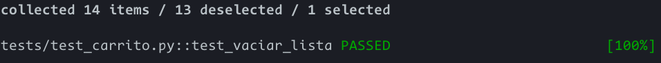
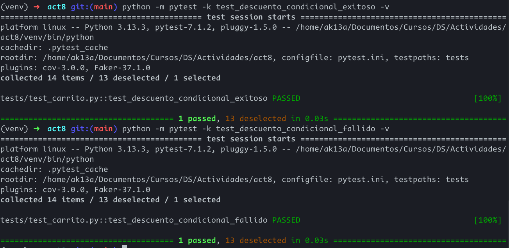
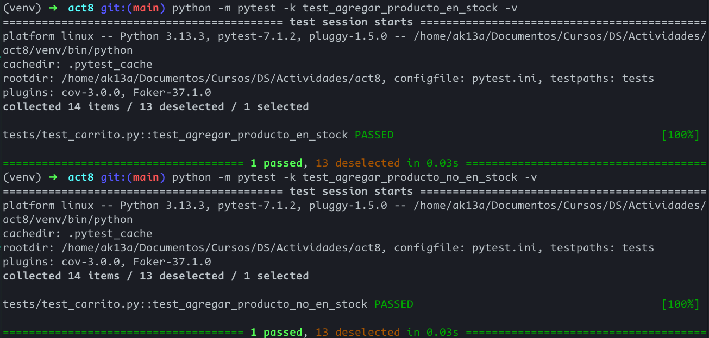
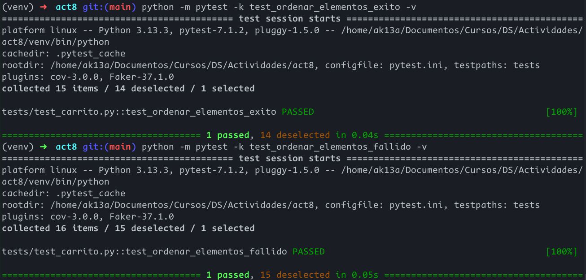

# Informe de la actividad 8

En esta actividad, se sigue un proceso de RGR para implementar diversas características en la lógica de un carrito de compras en Python. Las pruebas se realizan bajo una lógica AAA, lo cual las vuelve predecibles y fáciles de mantener.

## Ejercicio 1: Método para vaciar el carrito.

### carrito.py

En `carrito.py`, implementar el método de vaciado es simple: solo se asigna a `items` una lista vacía.
```python
    def vaciar(self):
        """
        Vacia el carro de compras.
        """
        self.items = []
```

### test_carrito.py

Se sigue el patrón Arrange - Act - Assert en las pruebas.

```python
def test_vaciar_lista():

    # Arrange
    carrito = Carrito()
    producto1 = ProductoFactory(nombre="Televisión", precio=1500.00)
    producto2 = ProductoFactory(nombre="Licuadora", precio=500.00)
    producto3 = ProductoFactory(nombre="Tostadora", precio=250.00)
    carrito.agregar_producto(producto1, cantidad=1)
    carrito.agregar_producto(producto2, cantidad=1)
    carrito.agregar_producto(producto3, cantidad=1)

    # Act
    carrito.vaciar()

    # Assert
    lista = carrito.obtener_items()

    assert lista == []
    assert len(lista) == 0
    assert carrito.calcular_total() == 0
```

### Ejecución de pytest



## Ejercicio 2: Descuento por compra mínima

Se debe implementar un descuento si el monto supera una cantidad determinada.

### carrito.py

Se implementa la función `aplicar_descuento_condicional(porcentaje, minimo)`.

```python
    def aplicar_descuento_condicional(self, porcentaje, minimo):
        """
        Aplica un descuento al total del carrito y retorna el total descontado.

        El porcentaje debe estar entre 0 y 100.
        """
        if porcentaje < 0 or porcentaje > 100:
            raise ValueError("El porcentaje debe estar entre 0 y 100")
        total = self.calcular_total()
        if total < minimo:
            return total
        descuento = total * (porcentaje / 100)
        return total - descuento
```

### test_carrito.py

Se agregó la lógica de prueba para calcular los descuentos, tanto exitosos como fallidos.

```python
def test_descuento_condicional_exitoso():
    # Arrange
    carrito = Carrito()
    producto1 = ProductoFactory(nombre="Televisión", precio=1500.00)
    producto2 = ProductoFactory(nombre="Licuadora", precio=500.00)
    producto3 = ProductoFactory(nombre="Tostadora", precio=250.00)
    carrito.agregar_producto(producto1, cantidad=1)
    carrito.agregar_producto(producto2, cantidad=1)
    carrito.agregar_producto(producto3, cantidad=1)

    # Act
    total_a_pagar = carrito.aplicar_descuento_condicional(porcentaje=15, minimo=500)

    # Assert
    assert total_a_pagar == 1912.50


def test_descuento_condicional_fallido():
    # Arrange
    carrito = Carrito()
    producto1 = ProductoFactory(nombre="Televisión", precio=250.00)
    producto2 = ProductoFactory(nombre="Licuadora", precio=100.00)
    producto3 = ProductoFactory(nombre="Tostadora", precio=50.00)
    carrito.agregar_producto(producto1, cantidad=1)
    carrito.agregar_producto(producto2, cantidad=1)
    carrito.agregar_producto(producto3, cantidad=1)

    # Act
    total_a_pagar = carrito.aplicar_descuento_condicional(porcentaje=15, minimo=500)

    # Assert
    assert total_a_pagar == 400.00
```

### Ejecución de pytest



## Ejercicio 3: Manejo de stock en producto

Se agrega un atributo `stock` en la clase Producto que maneja el stock máximo que se puede tener de un producto específico y se realizan las pruebas necesarias.

### carrito.py

Se debe modificar el método `agregar_producto()` para que verifique que no se agreguen más items de los permitidos y que lance un error en caso lo haga.
```python
class Producto:
    def __init__(self, nombre, precio, stock):
        self.nombre = nombre
        self.precio = precio
        self.stock = stock
        
...


class Carrito:

    def agregar_producto(self, producto, cantidad=1):
        """
        Agrega un producto al carrito. Si el producto ya existe, incrementa la cantidad.
        """
        for item in self.items:
            if item.producto.nombre == producto.nombre:
                if cantidad + item.cantidad <= producto.stock:
                    item.cantidad += cantidad
                    return
                else:
                    raise ValueError("No hay suficiente stock")
        if cantidad > producto.stock:
            raise ValueError("No hay suficiente stock")
        self.items.append(ItemCarrito(producto, cantidad))
```

### test_carrito.py
Se prueban los casos exitosos y fallidos.

```python
def test_agregar_producto_en_stock():

    # Arrange
    carrito = Carrito()
    producto1 = ProductoFactory(nombre="Televisión", precio=250.00)

    # Act
    carrito.agregar_producto(producto1, 4)

    # Assert
    item = carrito.obtener_items().pop()
    assert item.cantidad == 4


def test_agregar_producto_no_en_stock():

    # Arrange
    carrito = Carrito()
    producto1 = ProductoFactory(nombre="Televisión", precio=250.00, stock=5)

    # Act y Assert
    with pytest.raises(ValueError):
        carrito.agregar_producto(producto1, 6)
```

### Ejecución de pytest



## Ejercicio 4: Ordenar items del carrito

Se debe implementar una función que ordene los elementos del carrito dado un criterio. Se utiliza la función `sorted()` y una función lambda para determinar el criterio de orden.

### carrito.py

```python
    def obtener_items_ordenados(self, criterio: str):
        if criterio.upper() == "PRECIO":
            ordered_items = self.items
            ordered_items = sorted(ordered_items, key=lambda a: a.producto.precio)
            return ordered_items
        elif criterio.upper() == "NOMBRE":
            ordered_items = self.items
            ordered_items = sorted(ordered_items, key=lambda a: a.producto.nombre)
            return ordered_items
        elif criterio.upper() == "CANTIDAD":
            ordered_items = self.items
            ordered_items = sorted(ordered_items, key=lambda a: a.cantidad)
            return ordered_items
        else:
            return self.items
```

### test_carrito.py

```python
def test_ordenar_elementos_exito():

    # Arrange
    carrito = Carrito()
    producto1 = ProductoFactory(nombre="Televisión", precio=200.00)
    producto2 = ProductoFactory(nombre="Licuadora", precio=1500.00)
    producto3 = ProductoFactory(nombre="Tostadora", precio=500.00)
    carrito.agregar_producto(producto1, cantidad=3)
    carrito.agregar_producto(producto2, cantidad=2)
    carrito.agregar_producto(producto3, cantidad=1)

    # Act
    lista_ordenada_precio = carrito.obtener_items_ordenados("PRECIO")
    lista_ordenada_cantidad = carrito.obtener_items_ordenados("CANTIDAD")
    lista_ordenada_nombre = carrito.obtener_items_ordenados("NOMBRE")

    # Assert
    assert (
        lista_ordenada_precio[0].producto == producto1
        and lista_ordenada_precio[1].producto == producto3
        and lista_ordenada_precio[2].producto == producto2
    )
    assert (
        lista_ordenada_cantidad[0].producto == producto3
        and lista_ordenada_cantidad[1].producto == producto2
        and lista_ordenada_cantidad[2].producto == producto1
    )

    assert (
        lista_ordenada_nombre[0].producto == producto2
        and lista_ordenada_nombre[1].producto == producto1
        and lista_ordenada_nombre[2].producto == producto3
    )


def test_ordenar_elementos_fallido():
    # Arrange
    carrito = Carrito()
    producto1 = ProductoFactory(nombre="Televisión", precio=200.00)
    producto2 = ProductoFactory(nombre="Licuadora", precio=1500.00)
    producto3 = ProductoFactory(nombre="Tostadora", precio=500.00)
    carrito.agregar_producto(producto1, cantidad=3)
    carrito.agregar_producto(producto2, cantidad=2)
    carrito.agregar_producto(producto3, cantidad=1)

    # Act
    lista_ordenada_fallido = carrito.obtener_items_ordenados("PESO")

    # Assert
    assert (
        lista_ordenada_fallido[0].producto == producto1
        and lista_ordenada_fallido[1].producto == producto2
        and lista_ordenada_fallido[2].producto == producto3
    )
```

### Ejecución de pytest



## Ejercicio 5: Uso de Pytest Fixtures

En este ejercicio se reduce el código repetido en los tests utilizando `fixtures`, una funcionalidad de pytest que nos permite ahorrar código definiendo variables genéricas preestablecidas en cada prueba.

### conftest.py

Se crea un archivo de configuración de pytest con los fixtures necesarios. En este caso, un fixture con con un objeto carrito y un fixture con un producto genérico.

```python
import pytest
from src.carrito import Carrito
from src.factories import ProductoFactory


@pytest.fixture
def carrito():
    return Carrito()


@pytest.fixture
def producto_generico():
    return ProductoFactory(nombre="Genérico", precio=100.0, stock=10)
```

### test_carrito.py

En todos los tests se pueden reemplazar la creación de una nueva instancia de Carrito por el fixture de carrito, ahorrando una línea en cada test. En varios casos, además, se puede reemplazar el uso de un producto de prueba por el producto genérico creado en el fixture, por lo que se ahorra otro grupo de líneas de código en algunos tests. En otros, sin embargo, no se puede usar el producto genérico debido a que se requiere información precisa de precios o nombres, como en el caso de las pruebas para ordenar los productos.

Un ejemplo del uso de fixtures en la prueba de agregar productos que superen el stock:

```python
def test_agregar_producto_no_en_stock(carrito, producto_generico):

    # Arrange
    # Ya preparado en conftest
    # Act
    carrito.agregar_producto(producto_generico, 5)

    # Act y Assert
    with pytest.raises(ValueError):
        carrito.agregar_producto(producto_generico, 10)
```

## Ejercicio 6: Pruebas parametrizadas

Los parámetros también permiten ahorrar código realizando múltiples pruebas, tanto de casos válidos como inválidos, con parámetros que pytest utiliza automáticamente y pasa a las funciones. Esto permite probar distintos valores en la misma prueba sin duplicar código.

### test_carrito.py

```python
@pytest.mark.parametrize(
    "cantidad, porcentaje, minimo, esperado",
    [
        (5, 20, 200, 400),
        (5, 20, 600, 500),
    ],
)
def test_descuento_condicional_parametrizado(
    carrito, producto_generico, cantidad, porcentaje, minimo, esperado
):
    # Arrange
    carrito.agregar_producto(producto_generico, cantidad=cantidad)

    # Act
    total_a_pagar = carrito.aplicar_descuento_condicional(
        porcentaje=porcentaje, minimo=minimo
    )

    # Assert
    assert total_a_pagar == esperado
```

Este código prueba el caso en el que se aplica el descuento y el caso en el que el descuento no es aplicado con la misma prueba pero utilizando parámetros distintos. Si no se usaran los parámetros, se tendría que escribir dos pruebas distintas para ambos casos.

## Ejericico 7: Calcular impuestos en el carrito

En este ejercicio se sigue un desarrollo de tipo RGR:

### Prueba que falla - Rojo

Primero, se diseña una prueba simple. Esta prueba fallará porque no se ha implementado el método `calcular_impuesto()` todavía.

```python
@pytest.mark.parametrize(
    "cantidad, porcentaje_impuesto, impuesto_esperado",
    [
        (10, 10, 100),
        (10, 20, 200),
    ],
)
def test_calcular_impuestos(
    carrito, producto_generico, cantidad, porcentaje_impuesto, impuesto_esperado
):
    """
    Red: Se espera que calcular_impuestos retorne el valor del impuesto.
    """
    # Arrange
    carrito.agregar_producto(producto_generico, cantidad=cantidad)  # Total = 1000

    # Act
    impuesto = carrito.calcular_impuestos(porcentaje_impuesto)  # 10% de 1000 = 100

    # Assert
    assert impuesto == impuesto_esperado
```

### Implementación de calcular_impuesto() - Verde

Se implementa de forma básica la función `calcular_impuestos()` para que la prueba pase.

```python
def calcular_impuestos(self, porcentaje):
    total = self.calcular_total()
    return total * (porcentaje / 100)
```

### Refactorización 

En este punto, se mejora tanto el método como la prueba.

```python
   def calcular_impuestos(self, porcentaje):
       """
       Calcula el valor de los impuestos basados en el porcentaje indicado.
       
       Args:
           porcentaje (float): Porcentaje de impuesto a aplicar (entre 0 y 100).
       
       Returns:
           float: Monto del impuesto.
       
       Raises:
           ValueError: Si el porcentaje no está entre 0 y 100.
       """
       if porcentaje < 0 or porcentaje > 100:
           raise ValueError("El porcentaje debe estar entre 0 y 100")
       total = self.calcular_total()
       return total * (porcentaje / 100)
```


```python
@pytest.mark.parametrize(
    "cantidad, porcentaje_impuesto, impuesto_esperado, should_raise",
    [
        (10, 10, 100, False),
        (10, 20, 200, False),
        (10, -5, 200, True),
        (10, 200, 200, True),
    ],
)
def test_calcular_impuestos(
    carrito,
    producto_generico,
    cantidad,
    porcentaje_impuesto,
    impuesto_esperado,
    should_raise,
):
    """
    Red: Se espera que calcular_impuestos retorne el valor del impuesto.
    """
    # Arrange
    carrito.agregar_producto(producto_generico, cantidad=cantidad)  # Total = 1000

    if should_raise:
        with pytest.raises(ValueError):
            # Act y Assert
            carrito.calcular_impuestos(porcentaje_impuesto)

    else:
        # Act
        impuesto = carrito.calcular_impuestos(porcentaje_impuesto)  # 10% de 1000 = 100

        # Assert
        assert impuesto == impuesto_esperado
```

## Ejercicio 8: Aplicar cupón de descuento

Se aplica un descuento total al carrito mientras no supere un descuento máximo.

### Red

Se escribe la prueba que falla.

```python
def test_aplicar_cupon_con_limite(carrito, producto_generico):
    """
    Red: Se espera que al aplicar un cupón, el descuento no supere el límite máximo.
    """
    # Arrange
    carrito.agregar_producto(producto_generico, cantidad=2)  # Total = 400

    # Act
    total_con_cupon = carrito.aplicar_cupon(
        20, 50
    )  # 20% de 400 = 80, pero límite es 50

    # Assert
    assert total_con_cupon == 350.00
```

### Green

Se implementa el código mínimo para que la prueba pase.

```python
   def aplicar_cupon(self, descuento_porcentaje, descuento_maximo):
       total = self.calcular_total()
       descuento_calculado = total * (descuento_porcentaje / 100)
       descuento_final = min(descuento_calculado, descuento_maximo)
       return total - descuento_final
```

### Refactorización

Se mejora el código del cupón y la prueba asociada.

```python
   def aplicar_cupon(self, descuento_porcentaje, descuento_maximo):
       """
       Aplica un cupón de descuento al total del carrito, asegurando que el descuento no exceda el máximo permitido.
       
       Args:
           descuento_porcentaje (float): Porcentaje de descuento a aplicar.
           descuento_maximo (float): Valor máximo de descuento permitido.
       
       Returns:
           float: Total del carrito después de aplicar el cupón.
       
       Raises:
           ValueError: Si alguno de los valores es negativo.
       """
       if descuento_porcentaje < 0 or descuento_maximo < 0:
           raise ValueError("Los valores de descuento deben ser positivos")
       
       total = self.calcular_total()
       descuento_calculado = total * (descuento_porcentaje / 100)
       descuento_final = min(descuento_calculado, descuento_maximo)
       return total - descuento_final
```

```python
@pytest.mark.parametrize(
    "cantidad, descuento_porcentaje, descuento_maximo, total_esperado, should_raise",
    [
        (4, 20, 50, 350, False),
        (4, 20, 100, 320, False),
        (4, 20, -100, 320, True),
        (4, -100, 100, 320, True),
    ],
)
def test_aplicar_cupon_con_limite(
    carrito,
    producto_generico,
    cantidad,
    descuento_porcentaje,
    descuento_maximo,
    total_esperado,
    should_raise,
):
    """
    Red: Se espera que al aplicar un cupón, el descuento no supere el límite máximo.
    """
    # Arrange
    carrito.agregar_producto(producto_generico, cantidad=cantidad)  # Total = 400

    if should_raise:
        with pytest.raises(ValueError):
            # Act y Assert
            total_con_cupon = carrito.aplicar_cupon(
                descuento_porcentaje, descuento_maximo
            )

    else:
        # Act
        total_con_cupon = carrito.aplicar_cupon(descuento_porcentaje, descuento_maximo)
        # Assert
        assert total_con_cupon == total_esperado
```

