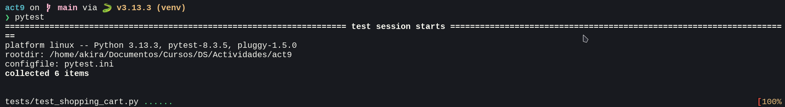
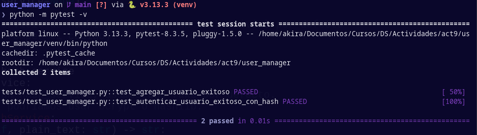
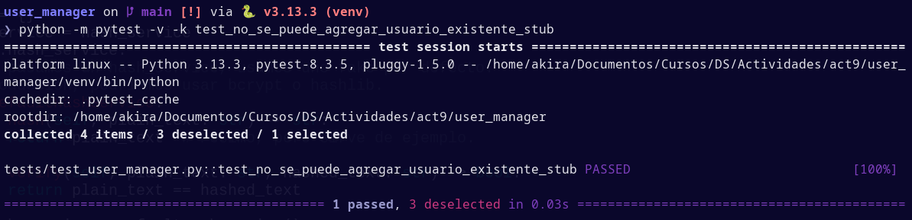
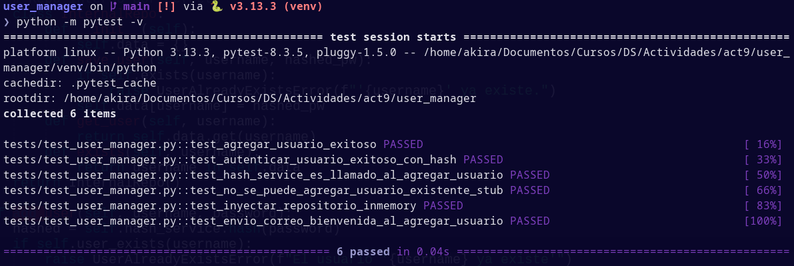

# Informe de actividad 9

Se busca desarrollar una clase que simule un carrito de compras mediante iteraciones del tipo **Red-Green-Refactor**. Cada iteración constará de tres etapas:

1. **Red**: Escribir una prueba que falle debido a que una funcionalidad no está implementada.
2. **Green**: Implementar la funcionalidad mínima necesaria.
3. **Refactor**: Mejorar el código sin cambiar su comportamiento y que pase las pruebas nuevamente.

Esto asegura un desarrollo enfocado a pruebas seguro y eficiente

## Iteraciones iniciales

### 1. Agregar artículos

- **Red**: Se implementa la prueba que verifica el funcionamiento de agregar productos al carrito. Esta fallará debido a que este funcionamiento no ha sido implementado.
- **Green**: Se implementa el funcionamiento en su forma más básica: un diccionario cuyas claves será el nombre del producto y de valor otro diccionario con claves "cantidad" y "precio" y sus valores correspondientes.
- **Refactor**: Todavía no es necesario refactorizar por lo sencillo del código.

### 2. Eliminar artículos

- **Red**: Se implementa la prueba para eliminar artículos.
- **Green**: Se escribe la lógica de eliminación: Se usa la palabra reservada `del` para eliminar el producto de nombre dado.
- **Refactor**: Se mejora `add_item` para el caso en el que se quiera agregar un producto ya presente en el carrito

### 3. Calcular total del carrito

- **Red**: Se implementa la prueba para calcular el precio total.
- **Green**: Se implementa la lógica: Se suma la multiplicación entre cantidad y precio de cada producto en el carrito iterativamente.
- **Refactor**: Se usa comprensión de lista para compactar el código y hacerlo más "pitónico".

## Segundo grupo de iteraciones

En este segundo grupo de iteraciones, la prueba nueva que se implementa es la de aplicar descuentos en la séptima iteración

### 7. Séptima iteración: Aplicar descuentos al total

- **Red**: Se generan pruebas para aplicar un descuento al precio total de una cantidad de productos.
- **Green**: Se implementa la lógica de descuentos simple: Se agrega un nuevo atributo `descuento` que es llamado en el cálculo del precio total para calcular el precio.
- **Refactor**: Se agrega una validación para que el descuento no sea ni negativo ni supere 100%.


## Acumulación de funcionalidades

Las iteraciones se caracterizan por construir sobre lo que se hizo en iteraciones anteriores. Esto garantiza que no se implementen funcionalidades conflictivas y que se obtenga una base de código sólida.

## Tercer grupo de iteraciones

La nueva funcionalidad implementada en el tercer grupo de iteraciones es la del procesamiento de pagos en una pasarela externa de pagos mediante **inyección de dependencias**, **mocks** y **stubs**.

### Doceava iteración: Procesar pagos a través de un servicio externo:

- **Red**: Se escribe una prueba que falle. Lo característico de esta prueba es el uso de `unittest.mock`, el cual genera una instancia de un objeto Mock que simula ser una pasarela de pago. Cuando se llame a `process_payment()` de `payment_gateway`, siempre retornará `True`.
```python
from unittest.mock import Mock

def test_process_payment():
    payment_gateway = Mock()
    payment_gateway.process_payment.return_value = True
    
    cart = ShoppingCart(payment_gateway=payment_gateway)
    cart.add_item("apple", 2, 0.5)
    cart.add_item("banana", 3, 0.75)
    cart.apply_discount(10)
    
    total = cart.calculate_total()
    result = cart.process_payment(total)
    
    payment_gateway.process_payment.assert_called_once_with(total)
    assert result == True
```

- **Green**: Se implementa la lógica de la pasarela de pago. Para esto, se simula de forma similar una pasarela mediante *inyección de dependencias*. Es decir, en lugar de crear una instancia de una pasarela de pagos en el constructor, es pasado un objecto de pasarela de pagos como parámetro. Esto permite una mayor flexibilidad para cambiar mocks, ya que no está *hardcodeado* en la clase del carrito de compras la implementación de la pasarela de pagos. Es decir, puedes **cambiar dependencias sin modificar la clase dependiente**.

```python
class ShoppingCart:
    def __init__(self, payment_gateway=None):
        self.items = {}
        self.discount = 0  # Porcentaje de descuento
        self.payment_gateway = payment_gateway  # Inyección de dependencia

        ...

    def process_payment(self, amount):
        if not self.payment_gateway:
            raise ValueError("No payment gateway provided.")
        return self.payment_gateway.process_payment(amount)
```

- **Refactor**: Se pueden manejar excepciones en caso la pasarela no haya sido bien implementada como dependencia o que la transacción no haya sido exitosa.

```python
    def process_payment(self, amount):
        if not self.payment_gateway:
            raise ValueError("No payment gateway provided.")
        try:
            success = self.payment_gateway.process_payment(amount)
            return success
        except Exception as e:
            # Manejar excepciones según sea necesario
            raise e
```

## Ejecución de pruebas
    
Estas pruebas ya estaban implementadas en los archivos de ejemplo, por lo que no fue necesario implementarlos, tan solo ejecutarlos con `pytest`.



## Mocks y stubs

### Mocks

Un objeto que simula el comportamiento de objetos reales de manera controlada. En el caso de las pruebas desarrolladas en esta actividad, `payment_gateway` es un objeto que simula el comportamiento de una pasarela de pagos.

### Stubs

Un objeto que proporciona respuestas predefinidas a llamadas realizadas en las pruebas. No implementan lógica. En esta actividad, un stub es `process_payment`, la cual siempre retornará `True`. Es decir, simula una transacción exitosa sin lógica subyacente.

## Inyección de dependencias

Como se explicó durante el desarrollo de las pruebas, la inyección de dependencias es un patrón de diseño en el que una clase recibe dependencias del exterior en lugar de crearlas internamente. En esta actividad, en lugar de definir una instancia de objeto `payment_gateway = PaymentGateway()`, simplemente se pasa como parametro y se crea un atributo `self.payment_gateway = payment_gateway`. De esta forma, se evita tener que cambiar la lógica en la clase cuando se cambie el mock de `payment_gateway` durante las pruebas.

## Buenas prácticas en pruebas

- **Pruebas unitarias**: Una prueba -> Una funcionalidad.
- **Aislamiento**: Se separan las pruebas de la clase ShoppingCart mediante la inyección de pruebas.
- **Cobertura de casos de uso**: Es importante cubrir los casos de fallo para asegurar el correcto manejo de errores en el software. 

## Ejercicio: UserManager

Se implementa la clase `UserManager`, la cual administrará usuarios mediante métodos y atributos necesarios, mediante iteraciones RGR. Se omite gran parte del código implementado ya que ya está propuesto por el archivo de instrucciones, al igual que el resultado de las pruebas.

### Iteración 1: Agregar usuario (Básico)

- **Red**: Se escribe la primera prueba para agregar un usuario con éxito mediante el método `add_user`. Está prueba fallará ya que no hay código fuente escrito fuera de esta prueba.
- **Green**: Se implementa una función básica para que la prueba pase. Se mantiene un diccionario cuyas claves sean el nombre de usuario y los valores sea la contraseña del usuario. Si el usuario ya existe y se intenta agregar, se lanza un error. Con esto, la prueba pasa.
- **Refactor**: Debido al diseño simple, se omite la refactorización por ahora.

### Iteración 2: Autenticación de usuario
Para asegurar contraseñas, se usarán *hashes*. Es decir, en lugar de almacenar la contraseña en texto plano, se almacenará su resultado al ser pasado por una función de hasheo, lo cual asegurará las contraseñas en caso sean filtradas.

- **Red**: Para esto, se simula una función de hash básica que prepende la cadena "fakehash" a las contraseñas, marcándolas como contraseñas "hasheadas". Este actúa como un *Fake* o *Mock*. Es decir, simula el comportamiento de una función de hasheo sin implementar una lógica de hashing.

```python
class FakeHashService:
    def hash(self, plain_text: str) -> str:
        return f"fakehash:{plain_text}"

    def verify(self, plain_text: str, hashed_text: str) -> bool:
        return hashed_text == f"fakehash:{plain_text}"
```

- **Green**: La función de hasheo se pasa como **inyección de dependencia** en la clase de UsarManager, evitando implementar la lógica en este clase y aislando el hasheo de la clase. Con esta implementación, la prueba pasa.



- **Refactorización**: La estructura cumple el propósito, por lo que no se modifica por ahora.

### Iteración 3: Uso de un Mock para verificar llamadas (Spy / Mock)

En esta iteración, usamos un *spy*. Los spy envuelven un objeto real y toman nota de cómo actúan, modificándolo opcionalmente para su testeo. Es un tipo de *mock*, pero basado en una lógica real implementada.

- **Red y Green**:

```python
from unittest.mock import MagicMock

def test_hash_service_es_llamado_al_agregar_usuario():
    # Arrange
    mock_hash_service = MagicMock()
    manager = UserManager(hash_service=mock_hash_service)
    username = "spyUser"
    password = "spyPass"

    # Act
    manager.add_user(username, password)

    # Assert
    mock_hash_service.hash.assert_called_once_with(password)
```

En este código se usa `MagiMock`, el cual, a diferencia de Mock, simula tanto funciones como atributos. Es decir, puedes llamar cualquier función desde un MagicMock y se creará en cuanto sea llamada.

Se puede ejecutar este test y pasar por las fases Red y Green, ya que la prueba implementada pasa exitosamente. La fase de refactor se saltea ya que no se necesita mejorar los métodos aún.

### Iteración 4: Excepción al agregar usuario existente (Stubs/más pruebas negativas)

Para forzar la situación de devolver un usuario que ya existe, se crea una clase UserManager a modo de *stub* que simplifica la lógica existente para que cualquier usuario agregado se considere como "ya existente". Esto garantiza que se pruebe la lógica de error sin agregar usuarios ni simular bases de datos.

- **Red**: Se escribe la prueba.

```python
def test_no_se_puede_agregar_usuario_existente_stub():
    # Este stub forzará que user_exists devuelva True
    class StubUserManager(UserManager):
        def user_exists(self, username):
            return True

    stub_manager = StubUserManager()
    with pytest.raises(UserAlreadyExistsError) as exc:
        stub_manager.add_user("cualquier", "1234")

    assert "ya existe" in str(exc.value)
```

Pese a que las instrucciones no lo especifican, esta prueba falla, ya que el método `user_exists()` no está implementado en la lógica para agregar usuarios. Por lo tanto, es necesario entrar a la fase Green.

- **Green**: Se implementa la función `user_exists()` en la lógica de agregar usuarios.

```python
    def add_user(self, username, password):
        # Se usa user_exists(username)
        if self.user_exists(username):
            raise UserAlreadyExistsError(f"El usuario '{username}' ya existe.")
        hashed_pw = self.hash_service.hash(password)
        self.users[username] = hashed_pw
```



- **Refactor**: La lógica sigue siendo básica, por lo que no se modifica todavía.

### Iteración 5: Inyección de un repositorio (Fake)

La funcionalidad de UserManager necesita ser más compleja: se debe inyectar en producción un repositorio real. Sin embargo, esto puede limitar las pruebas, ya que requerirían acceder a este repositorio para asegurar la funcionalidad de UserManager. Por este motivo, se introducen *Fakes* que simulen el comportamiento de un repositorio sin implementar uno real.

- **Red**: Se implementa una prueba con un repositorio falso que guarda los datos en memoria local y se realizan pruebas con este repositorio simulado. La prueba falla porque el repositorio todavía no es implementado en el código fuente.

- **Green**: Se implementa un repositorio interno por defecto (usado en caso no se especifique ningún repositorio) en la clase de UserManager con funcionalidades similares a las de la clase en si. El código fue modificado ligeramente para que usara `user_exists()` en lo posible para que las pruebas sean válidas. Se saltea la refactorización.
```python
class UserManager:
    def __init__(self, hash_service=None, repo=None):
        """
        Si no se provee un servicio de hashing, se asume un hash trivial por defecto
        (simplemente para no romper el código).
        """
        self.hash_service = hash_service or self._default_hash_service()
        self.repo = repo or self._default_repo()

    def _default_hash_service(self):
        # Hash por defecto si no se provee nada (inseguro, solo para no romper).
        class DefaultHashService:
            def hash(self, plain_text: str) -> str:
                return plain_text
            def verify(self, plain_text: str, hashed_text: str) -> bool:
                return plain_text == hashed_text
        return DefaultHashService()


    def _default_repo(self):
        # Repo interno por defecto
        class InternalRepo:
            def __init__(self):
                self.data = {}
            def save_user(self, username, hashed_pw):
                if self.exists(username):
                    raise UserAlreadyExistsError(f"'{username}' ya existe.")
                self.data[username] = hashed_pw
            def get_user(self, username):
                return self.data.get(username)
            def exists(self, username):
                return username in self.data
        return InternalRepo()

    def add_user(self, username, password):
        hashed = self.hash_service.hash(password)
        if self.user_exists(username):
            raise UserAlreadyExistsError(f"El usuario '{username} ya existe'")
        self.repo.save_user(username, hashed)

    def user_exists(self, username):
        return self.repo.exists(username)

    def authenticate_user(self, username, password):
        stored_hash = self.repo.get_user(username)
        if stored_hash is None:
            raise UserNotFoundError(f"El usuario '{username}' no existe.")
        return self.hash_service.verify(password, stored_hash)
```

### Iteración 6: Spy de servicio de correo

Se simula el envío de un correo de bienvenida cuando se registre un nuevo usuario. Para esto, se implementa un *spy*.

- **Red**: Se implementa una prueba que falle por no existir lógica de correo en el código fuente. Se crea un spy con MagicMock y se pasa como parámetro a UserManager mediante inyección de dependencias.

- **Green**: Se implementa mediante inyección de dependencias a UserManager la lógica de correos. Si es que el usuario es agregado exitosamente, se envía un correo de bienvenida.

### Ejecución final de pruebas



### Conclusiones

- La técnica de desarrollo basada en iteraciones de tipo RGR permite construir código estable, progresivo y auto-documentado de forma sencilla y lógica. 
- Establecer las pruebas antes de las característiacs permite definir la forma en la que una característica debe funcionar y los resultados esperados, lo cual esclarece el comportamiento de la función incluso antes de haberla escrito.
- Los *mocks*, *fakes*, *spies*, inyección de dependencias y demás permiten diseñar y ejecutar pruebas incluso sin tener una infraestructura o lógica completa. Esto permite probar una mayor cantidad de funcionalidades que dependan de recursos externos no necesariamente disponibles al momento de realizar las pruebas.
- En particular, los mocks demuestran ser bastante útiles para forzar caminos en la lógica del código y hacer que las pruebas revisen todas las funcionalidades sin tener que invertir tiempo o recursos en definir bases de datos falsas.
