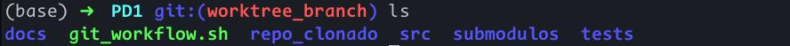
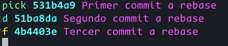

# Práctica dirigida 1

## Ejercicio 1: Configuración inicial y clonación de repositorios

Se ejecutó el script y se verificó la inicialización del repositorio y la creación del directorio `repo_clonado` llamado `pd1-dummy-repo`.

## Ejercicio 2: Estructuración y commit inicial

Se verifica la estructura correcta del proyecto y la documentación.

Además, se revisó el historial de commits

## Ejercicio 3: Comparación de versiones y uso de stash

Primero se agregó un comentario a `main.py` que va a ser corregido.

Luego se usó la función de stash para experimentar con cambios no comiteados.

## Ejercicio 4: Inspección y análisis del historial

Salida de `git blame`:

El historial de ramas distingue claramente entre la rama principal y las ramas de arreglos o hotfixes. Esto permite distinguir entre los cambios significativos y las soluciones a errores claramente.

## Ejercicio 5: Deshacer cambios y reset

Primero, creo un commit revertible y lo revierto.

Luego, experimento con las opciones de `git reset --hard`, `--mixed` y `--soft`. Primero, con la opción de `git reset --soft`, la cual no revierte los cambios en el área de staging y los cambios en el índice de trabajo.

Luego, con `git reset --mixed`, los cambios del área de staging salen de esta.

Finalmente, con `git reset --hard`, todos los cambios, tanto en el área de staging como en el índice de trabajo, son revertidos al commit especificado.

## Ejercicio 6: Rebase interactivo y reflog

Preparando los commits y ejecutando `git rebase -i`.

Luego, ejecutando `git reflog`

## Ejercicio 7: Sincronización de repositorios

Agrego un repositorio personal al remoto del repositorio y verificando la conexión con `git ls-remote`.

## Ejercicio 8: Branching y merging avanzado

En este ejercicio, probé la funcionalidad de octopus merge con tres ramas: octopus/first, octopus/second y octopus/third.

Haciendo el octopus merge y mostrando el resultado de la fusión.

## Ejercicio 9: Localización de errores con bisect

Ejecutando `git bisect` en hotfix-2, pude delimitar el commit malo.

## Ejercicio 10: Submódulos y hooks

Primero, importo un submódulo desde el repositorio remoto de prueba que creé. Inmediatamente después, hago un commit de prueba para verificar los hooks.

## Ejercicio 11: Historial y worktrees

Pruebo la limpiza del historial usando `git filter-branch`. No pude implementar worktrees diferentes al de por defecto en este repositorio por conflictos con el worktree principal.

## Ejercicio 12: Árbol de Merkle

Ejecución de Merkle Trees y sus pruebas unitarias.

