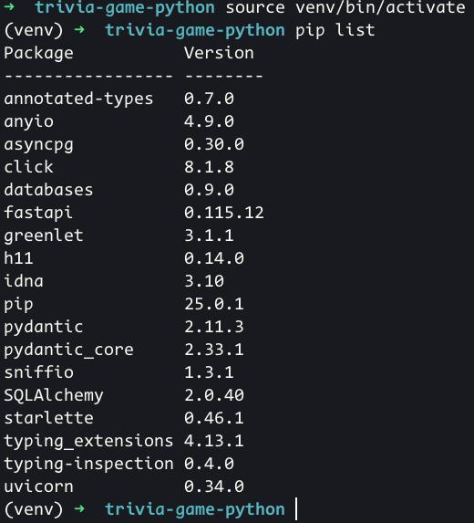
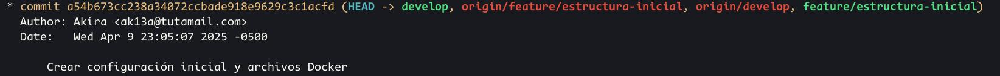
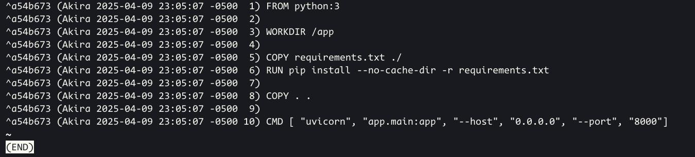
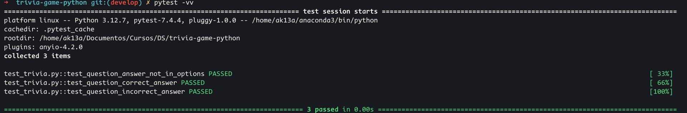
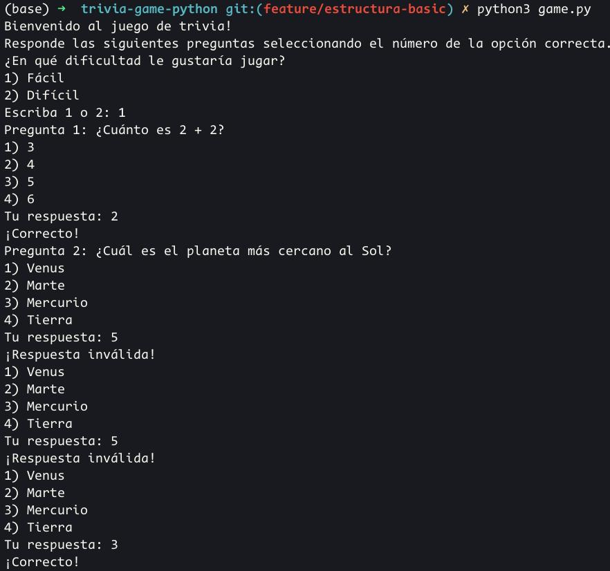
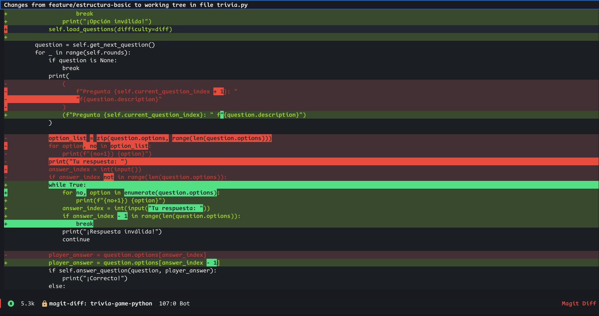

# Informe de la prueba de entrada

## Enlace del repositorio del proyecto

https://github.com/Akira-13/PE-CC3S2

## Día 1 - Configuración del entorno y estructura básica (Sprint 1 – Parte 1)

### Creación del proyecto

Después de ejecutar los comandos para la creación del ambiente virtual de Python, tengo el siguiente `pip list`



### Dockerfile y docker-compose.yml

Para este proyecto, el contenedor debe ser un ambiente para FastAPI y PostgreSQL. Para el primer servicio, se puede usar el Dockerfile provisto para [Python en dockerhub](https://hub.docker.com/_/python/), mientras que para [PostgreSQL](https://hub.docker.com/_/postgres/) se puede configurar en un `compose.yml`.

#### Dockerfile para FastAPI

``` dockerfile
FROM python:3

WORKDIR /app

COPY requirements.txt ./
RUN pip install --no-cache-dir -r requirements.txt

COPY . .

CMD [ "uvicorn", "app.main:app", "--host", "0.0.0.0", "--port", "8000"]

```

1. Establece el directorio de trabajo en `/app`.
2. Copia los requerimientos y los instala en el contenedor.
3. Copia los contenidos del directorio actual en el directorio de trabajo del contenedor.
4. Ejecuta una serie de comandos:
   - Ejecuta un servidor Uvicorn.
   - Busca al objeto `app` en `main.py` en el directorio `app`.
   - Expone el servidor en el puerto 8000, el puerto por defecto para Uvicorn.

#### compose.yml para el contenedor y PostgreSQL

``` yaml
services:
  web:
    build: .
    depends_on:
     - db
    ports:
     - "8000:8000"
    volumes:
     - .:/app

  db:
    image: postgres
    restart: always
    ports:
     - "5432:5432"
    environment:
      POSTGRES_PASSWORD: password
    volumes:
      - postgres_data:/var/lib/postgresql/data/

volumes:
  postgres_data:
```

1. Se definen los servicios `web` y `db`
2. Se construye el contenedor en el directorio en el que se encuentra compose.yml
3. El puerto 8000 del host llevará al puerto 8000 en el contenedor.
4. El directorio actual será montado en el directorio /app del contenedor.
4. El servicio web depende de `db`, entonces `db` será levantado primero.
5. `db` importa la imagen de DockerHub de Postgres.
6. Si este sufre caídas, se reinicia automáticamente.
7. Mapea el puerto 5432 del contenedor al 5432 del host.
8. La contraseña será "password". El usuario por defecto será "postgres" y la base de datos por defecto "postgres".
9. Establece un volumen para almacenar datos persistentemente. Caso contrario, cuando el contenedor se reinicie, todos los datos se perderían.

Con estos archivos tengo listo el ambiente de desarrollo de la aplicación y puedo preparar el repositorio.

### Creación del repositorio

Como se pide en las instrucciones, creé una rama `develop` y otra `feature/estructura-inicial` con todos los archivos creados. Usé un archivo `.gitignore` para evitar cargar el ambiente virtual al repositorio.



### Registro diario

No es necesario ejecutar `git diff` para el primer commit. Solo muestro el resultado de `git blame` en el primer día para los archivos más importantes.

#### Blame en compose.yml


#### Blame en Dockerfile



## Día 2 - Implementación de la clase Question y pruebas unitarias (Sprint 1 – Parte 2)

### Clase Question

Primero, implementé la clase `Question` con la documentación necesaria. Además, agregué un chequeo en el constructor de la clase para verificar que la respuesta correcta se encuentre en la lista de opciones. Caso contrario, se lanza un error.

```python
class Question:
    """
    Class that represents a question to be displayed in the game.

    ...

    Attributes
    ----------
    description : str
        String representing the question content
    options : list[str]
        List of strings representing the answer choices for the question
    correct_answer : str
        Correct answer included in the options list

    Methods
    -------
    is_correct(answer : str)
        Compares the provided answer with the stored correct answer

    """

    def __init__(self, description, options, correct_answer):
        """
        Initializes a question with the given parameters.
        Parameters
        ----------
        description : str
            String representing the question content
        options : list[str]
            Array of strings representing the answer choices for the question
        correct_answer : int
            Correct answer included in the options list

        Raises
        -------
        Value error
            If the correct answer is not in option
        """
        self.description = description
        self.options = options
        self.correct_answer = correct_answer
        if correct_answer not in options:
            raise ValueError(
                f"Correct answer {correct_answer} is not in the options list!"
            )

    def is_correct(self, answer):
        """Compares the provided answer with the stored correct answer"""
        return self.correct_answer == answer
```

### Pruebas unitarias para Question

Documenté las pruebas unitarias provistas en las instrucciones y agregué una prueba que verifica que se lanza un error `ValueError` cuando la respuesta no se encuentra en las opciones de la pregunta.

```python
import pytest
from trivia import Question


def test_question_answer_not_in_options():
    """
    Test that Question raises ValueError if correct_answer is not in options
    list
    """
    with pytest.raises(ValueError):
        question = Question("What is 2 + 2?", ["1", "2", "3", "4"], "5")


def test_question_correct_answer():
    """
    Test that is_correct() returns True when the given answers match.
    """
    question = Question("What is 2 + 2?", ["1", "2", "3", "4"], "4")
    assert question.is_correct("4")


def test_question_incorrect_answer():
    """
    Test that is_correct() returns False when the given answers don't match.
    """
    question = Question("What is 2 + 2?", ["1", "2", "3", "4"], "4")
    assert not question.is_correct("2")
```

#### Ejecución de pruebas



### Commit


### Registro diario

No modifiqué ninguno de los archivos existentes, solo creé dos nuevos archivos. Por lo tanto, solo mostraré los resultados de `git blame`.

#### Blame en trivia.py


#### Blame en test_trivia.py


## Día 3 - Implementación de la clase Quiz y flujo básico del juego (Sprint 1 – Parte 3)

Primero, corregí algunos errores en los docstrings de la clase Question e implementé un docstring general para el módulo. Con este nuevo commit empecé a trabajar en la clase Quiz.

### Clase Quiz

Implementé la clase Quiz junto al método `run_quiz()` para mostrar las preguntas en consola.

```python
class Quiz:
    """
    Class that manages the game flow.

    ...

    Attributes
    ----------
    questions: list[Question]
        List of Question instances to be displayed during the game.
    current_question_index: int
        The index of the current question shown in the game.

    Methods
    -------
    add_question(question : Question)
        Add a question to the Quiz question list.
    get_next_question()
        Return the question next to the current index.
    run_quiz()
        Show each question and expects player input.
    """

    def __init__(self):
        """Initialize empty Quiz instance.

        Parameters
        ----------
        questions: list[Question], default []
            An empty list of questions.
        current_question_index: int, default 0
            The index of the current question displayed in the game.
        """
        self.questions = []
        self.current_question_index = 0

    def add_question(self, question):
        """Add question to the end of the question list.

        Parameters
        ----------
        question: Question
            Question to be added at the end of the list.

        Raises
        ------
        TypeError
            If the question is not instance of Question class.
        """
        if not isinstance(question, Question):
            raise TypeError("Question is not instance of Question class!")
        self.questions.append(question)

    def get_next_question(self):
        """Get next question to the index if it exists.

        Returns
        -------
        question
            Next question in the list.
        None
            If method is called from last question in list.
        """
        if self.current_question_index < len(self.questions):
            question = self.questions[self.current_question_index]
            self.current_question_index += 1
            return question
        return None

    def run_quiz(self):
        """Run quiz game.

        Show each question and its options properly formatted
        and expects player input as their answer. If the answer
        belongs to options, shows right or wrong message and
        displays next question. Otherwise, shows the same question
        again.
        """
        welcome = (
            "Bienvenido al juego de trivia!\nResponde las siguientes "
            "preguntas seleccionando el número de la opción correcta."
        )
        print(welcome)
        question = self.questions[self.current_question_index]
        while question is not None:
            print(
                (
                    f"Pregunta {self.current_question_index + 1}: "
                    "f{question.description}"
                )
            )

            option_list = zip(question.options, range(len(question.options)))
            for option, no in option_list:
                print(f"{no+1}) {option}")
            print("Tu respuesta: ")
            answer_index = int(input())
            if answer_index not in range(len(question.options)):
                print("¡Respuesta inválida!")
                continue

            player_answer = question.options[answer_index]
            if question.is_correct(player_answer):
                print("¡Correcto!")
            else:
                print("¡Incorrecto!")

            question = self.get_next_question()
```

### Nueva rama y commit

Se creó la rama "feature/estructura-basic" y se hizo commit con la nueva clase.


### Registro diario

#### Diff en trivia.py


#### Blame en trivia.py


## Día 4 - Sistema de puntuación, manejo de rondas y finalización del juego (Sprint 2)

### Implementación de atributos

Se implementaron los atributos `correct_answers`, `incorrect_answers` y `rounds`. Los dos primeros llevan un conteo del número de preguntas respondidas correcta e incorrectamente. El último es un valor entero que limita el número de preguntas a mostrar en el juego. 

### Implementación del método `anser_question`

```python
    def answer_question(self, question, answer):
        """Check if answer is correct to question.

        Compares the given answer to a question's correct option,
        updates correct or incorrect answer counter, and returns
        True or False.

        Parameters
        ----------
        question: Question
            A Question instance with a correct option.
        answer: str
            The answer to be compared to the correct option.

        Returns
        -------
        True
            If answer to question is correct.
        False
            If answer to question is incorrect.
        """
        if question.is_correct(answer):
            self.correct_answers += 1
            return True
        else:
            self.incorrect_answers += 1
            return False
```

### Manejo de rondas

Para el manejo de rondas, solo se agregó un bucle `for` a las preguntas mostradas, además de un mensaje final al terminar las rondas.

```python
        question = self.get_next_question()
        for _ in range(self.rounds):
            if question is None:
                break
            print(
                (
                    f"Pregunta {self.current_question_index + 1}: "
                    "f{question.description}"
                )
            )

.......

        print("Juego terminado. Aquí esta tu puntuación:")
        print(f"Preguntas contestadas: {self.rounds}")
        print(f"Respuestas correctas: {self.correct_answers}")
        print(f"Respuestas incorrectas: {self.incorrect_answers}")
```

### Pruebas unitarias

Se implementaron pruebas unitarias para los contadores de puntuación, la función `get_next_question` y el caso límite en el que se quiera agregar alguna variable que no sea instance de Question a la lista de preguntas.

```python
def test_quiz_scoring():
    """
    Test that correct and incorrect questions are properly validated.
    """
    quiz = Quiz()
    question = Question("What is 2 + 2?", ["1", "2", "3", "4"], "4")
    quiz.add_question(question)
    assert quiz.answer_question(question, "4") is True
    assert quiz.correct_answers == 1
    assert quiz.answer_question(question, "2") is False
    assert quiz.incorrect_answers == 1


def test_add_question_not_instace_of_Question():
    """
    Test that adding anything but an instance of Question raises TypeError.
    """
    quiz = Quiz()
    question = "I raise an error in Quiz!"
    with pytest.raises(TypeError):
        quiz.add_question(question)


def test_next_questions():
    """
    Test that getting the next question works up until no questions are left.
    """
    first_question = Question("What is 2 + 2?", ["1", "2", "3", "4"], "4")
    second_question = Question("What is 4 * 0?", ["4", "1", "0", "-1"], "0")
    quiz = Quiz()
    quiz.add_question(first_question)
    quiz.add_question(second_question)
    assert quiz.get_next_question() is first_question
    assert quiz.get_next_question() is second_question
    assert quiz.get_next_question() is None
```

#### Ejecución de pruebas


### Commit

Con la clase y pruebas hechas, hice commit en la rama feature/estructura-basic. Esto se puede ver al ejecutar `git-blame`.

### Registro diario

#### Blame en la clase Quiz


## Día 5 - Mejoras en la interfaz de usuario y refinamientos (Sprint 3)

### Mejorar la lógica en run_quiz()

Mejoré la lógica en `run_quiz()` y agregué una función `load_questions()` para cargar preguntas por defecto en un archivo .json. También agregué la posibilidad de elegir la dificultad de estas preguntas.

```python
def run_quiz(self):

...

        # If no questions have been loaded, load default questions by
        # asking player difficulty.
        if not self.questions:
            diff = ""
            while True:
                diff = input(
                    "¿En qué dificultad le gustaría jugar?\n"
                    "1) Fácil\n"
                    "2) Difícil\n"
                    "Escriba 1 o 2: "
                ).lower()
                if diff == "1" or diff == "2":
                    break
                print("¡Opción inválida!")
            self.load_questions(difficulty=diff)
```

```python
    def load_questions(self, path="DEFAULT", difficulty="1"):
        """Load questions from file.

        Loads the questions from a given file path in JSON format. If
        only difficulty is given, it loads default questions from file.

        Parameters
        ----------
        path: str, default "DEFAULT"
            A file path with questions in JSON format.
        difficulty: str, default "1"
            Difficulty to distingish between easy and hard default questions.
        """
        if path == "DEFAULT" and difficulty == "1":
            with open("./default_questions.json", "r") as file:
                data = json.load(file)
                for q in data.get("easy_questions", []):
                    self.add_question(
                        Question(q["description"], q["options"], q["correct_answer"])
                    )
        elif path == "DEFAULT" and difficulty == "2":
            with open("./default_questions.json", "r") as file:
                data = json.load(file)
                for q in data.get("hard_questions", []):

                    self.add_question(
                        Question(q["description"], q["options"], q["correct_answer"])
                    )
        else:
            with open(path, "r") as file:
                data = json.load(file)
                for q in data.get("questions", []):
                    self.add_question(
                        Question(q["description"], q["options"], q["correct_answer"])
                    )
```

### Probando la interfaz de juego




### Blame y Diff

Después de hacer commit con estos cambios en la rama "feature/ui-improvements", puedo revisar qué cambios se tienen.

#### Diff 




#### Blame


### Fusionar en la rama develop

Con el juego principal terminado, puedo fusionar en la rama principal `develop`.


## Día 6 - Pipeline CI/CD y pruebas de integración

### Creación de archivo para flujo CI

```yaml
name: Python CI

on:
  push:
    branches: [develop, main]

jobs:
  build:
    runs-on: ubuntu-latest
    steps:
      - uses: actions/checkout@v2
      - name: Set up Python
        uses: actions/setup-python@v2
        with:
          python-version: '3.12'
      - run: pip install -r requirements.txt
      - run: pytest
      - name: SonarQube Scan
        uses: SonarSource/sonarqube-scan-action@v5.1.0
        env:
          SONAR_TOKEN: ${{ secrets.SONAR_TOKEN }}
        with:
          args: >
            -Dsonar.organization=akira-13
            -Dsonar.projectKey=Akira-13_PE-CC3S2
            -Dsonar.sources=app/
            -Dsonar.tests=tests/
            -Dsonar.verbose=true
      - name: Run Security Scan
        run: bandit -c bandit.yaml -r .
```

En un inicio, la primera versión de este archivo me resultó en varios errores por una mala configuración de SonarQube y Bandit. Solo pude probarlo en la fusión con la rama principal, por lo que tuve que mejorarlo en el día final. Este código es la versión final del archivo con las claves para SonarQube Cloud apropiadamente configuradas desde sonarqube.io, al igual que el nombre de organización y clave del proyecto. Me guié de [la página oficial de la acción para SonarQube](https://github.com/SonarSource/sonarqube-scan-action).

### Pruebas de integración

Para las pruebas de integración se usa `pytest` para testear los endpoints expuestos con FastAPI. Primero, expuse los endpoints con FastAPI, usando algunas funciones de mi clase `trivia.py`.

#### Archivo main.py con endpoints

```python
import json
from contextlib import asynccontextmanager
from typing import Dict, List, Optional
from dotenv import load_dotenv
from fastapi import FastAPI, HTTPException
from fastapi.middleware.cors import CORSMiddleware
from pydantic import BaseModel
import os
from .trivia import Question, Quiz

load_dotenv()

app = FastAPI(title="Trivia Game API")

# Global quiz instance
quiz = Quiz()

db_url = os.getenv("DB_URL")
secret_key = os.getenv("SECRET_KEY")


@app.get("/config-check")
async def check_config():
    return {
        "db_url": db_url,
        "db_connected": bool(db_url),
    }


class QuestionData(BaseModel):
    description: str
    options: list[str]
    correct_answer: str


@asynccontextmanager
async def lifespan(app: FastAPI):
    """Load default questions when the app starts."""
    quiz.load_questions(difficulty="1")
    yield
    quiz.load_questions(difficulty="1")


@app.get("/")
async def root():
    """Test message."""
    return {"message": "Welcome to the Trivia Game API"}


@app.get("/questions/next")
async def get_next_question():
    """Get the next question in the quiz."""
    question = quiz.get_next_question()
    if not question:
        raise HTTPException(status_code=404, detail="No more questions available")
    return {
        "question_no": quiz.current_question_index - 1,
        "description": question.description,
        "options": question.options,
        "correct_answer": question.correct_answer,
    }


@app.post("/questions")
async def create_question(question_data: QuestionData):
    """Add question to question list."""
    try:
        q = Question(
            description=question_data.description,  # Access as attributes
            options=question_data.options,
            correct_answer=question_data.correct_answer,
        )
        quiz.add_question(q)
        return {"message": "Question added successfully"}
    except ValueError as e:
        raise HTTPException(status_code=400, detail=str(e))


@app.post("/questions/answer")
async def answer_question(answer_data: dict):
    """Submit an answer to the current question."""
    if "answer" not in answer_data:
        raise HTTPException(status_code=400, detail="Answer is required")

    current_index = quiz.current_question_index - 1
    if current_index not in range(len(quiz.questions)):
        raise HTTPException(status_code=400, detail="No active question to answer")

    question = quiz.questions[current_index]
    is_correct = quiz.answer_question(question, answer_data["answer"])

    return {
        "is_correct": is_correct,
        "correct_answer": question.correct_answer,
        "score": {"correct": quiz.correct_answers, "incorrect": quiz.incorrect_answers},
    }


@app.get("/quiz/reset")
async def reset_quiz(difficulty="1"):
    """Reset the quiz with new questions."""
    global quiz
    quiz = Quiz()
    quiz.load_questions(difficulty=difficulty)
    return {"message": "Quiz reset successfully"}


@app.get("/quiz/empty")
async def empty_quiz():
    """Empty the quiz with new questions."""
    global quiz
    quiz = Quiz()
    return {"message": "Quiz emptied successfully"}


@app.get("/quiz/stats")
async def get_quiz_stats():
    """Get current quiz statistics."""
    return {
        "total_questions": len(quiz.questions),
        "current_question": quiz.current_question_index,
        "correct_answers": quiz.correct_answers,
        "incorrect_answers": quiz.incorrect_answers,
    }
```

#### Pruebas de integración

Las pruebas son almacenadas en tets/test_main.py

```python
import pytest
from fastapi.testclient import TestClient
from app.main import app
from app.trivia import Quiz

client = TestClient(app)

SAMPLE_QUESTIONS = [
    {"description": "What is 2+2?", "options": ["3", "4", "5"], "correct_answer": "4"},
    {
        "description": "Capital of France?",
        "options": ["London", "Paris", "Berlin"],
        "correct_answer": "Paris",
    },
]


# @pytest.fixture(autouse=True)
# def reset_quiz_state():
#     """Reset the quiz before each test"""
#     quiz = Quiz()
#     yield
#     quiz = Quiz()  # Reset again after test


def test_quiz_reset():
    """Test quiz resets properly"""

    response = client.get("/quiz/reset")
    assert response.status_code == 200
    response = client.get("/quiz/stats")
    assert response.json()["total_questions"] == 10


def test_empty_quiz():
    """Test successfully creating a question"""

    response = client.get("/quiz/empty")

    assert response.status_code == 200
    assert response.json() == {"message": "Quiz emptied successfully"}


def test_create_question_success():
    """Test successfully creating a question"""

    client.get("/quiz/empty")
    response = client.post("/questions", json=SAMPLE_QUESTIONS[0])

    assert response.status_code == 200
    assert response.json() == {"message": "Question added successfully"}


def test_cycle_questions():
    """Test successfully creating a question"""

    client.get("/quiz/empty")
    client.post("/questions", json=SAMPLE_QUESTIONS[0])
    client.post("/questions", json=SAMPLE_QUESTIONS[1])

    response = client.get("questions/next")
    assert response.status_code == 200
    assert response.json()["description"] == SAMPLE_QUESTIONS[0]["description"]
    response = client.get("questions/next")
    assert response.status_code == 200
    assert response.json()["description"] == SAMPLE_QUESTIONS[1]["description"]
    response = client.get("questions/next")
    assert response.status_code == 404


def test_answer_questions():
    """Test successfully creating a question"""

    client.get("/quiz/empty")
    client.post("/questions", json=SAMPLE_QUESTIONS[0])
    client.post("/questions", json=SAMPLE_QUESTIONS[1])

    client.get("questions/next")
    response = client.post("/questions/answer", json={"answer": "4"})
    assert response.status_code == 200
    assert response.json()["is_correct"] is True
    response = client.post("/questions/answer", json={"answer": "Berlin"})
    assert response.status_code == 200
    assert response.json()["is_correct"] is False
    response = client.get("/quiz/stats")
    assert response.json()["correct_answers"] == 1
    assert response.json()["incorrect_answers"] == 1
```

El resultado de las pruebas se verá automáticamente en el flujo CI al hacer push en la rama principal.

### Commits diarios

#### Commit con los endpoints


#### Commit con la configuración CI


## Día 7 - Gestión de configuración, seguridad y pruebas de rendimiento

### Creación de dotenv y carga

Creé un archivo `.env` con algunos datos sensibles, como la clave de sesión y URL de la base de datos.

```lang
DB_URL=postgresql://postgres:password@db:5432/postgres
SECRET_KEY=8Ee6m####################################
```

Este archivo no será cargado al repositorio remoto y está incluido en `.gitignore`. La carga de este archivo se hace en `main.py` con las siguientes sentencias:

```python
load_dotenv()
db_url = os.getenv("DB_URL")
secret_key = os.getenv("SECRET_KEY")
```

### Pruebas de seguridad con bandit

Bandit revisa automáticamente el código en el repositorio para encontrar fallas de seguridad comunes. Para evitar falsos positivos, incluí un archivo simple de configuración `bandit.yaml` para evitar que revise archivos de prueba.

```yaml
exclude_dirs: ['tests/', 'locustfile.py']
```

En el archivo para el flujo CI, bandit se llama de la siguiente forma:

```yaml
      - name: Run Security Scan
        run: bandit -c bandit.yaml -r .
```

### Pruebas de carga con Locust

Locust permite simular la interacción con los endpoints de un número grande de usuarios de forma similar a los archivos de prueba. Implementé el siguiente archivo de prueba de carga `locustfile.py`

```python
from locust import HttpUser, task, between
import random


class TriviaUser(HttpUser):
    wait_time = between(2, 4)  # Random wait between requests

    def on_start(self):
        """Login/setup (runs once per virtual user)"""
        self.client.get("/quiz/reset")

    @task(3)  # Weighted probability
    def play_trivia_round(self):
        """Simulate a player answering questions"""
        # 1. Get next question
        question_resp = self.client.get("/questions/next")
        if not question_resp.ok:
            return

        question = question_resp.json()

        # 2. Submit random answer
        options = question["options"]
        answer = random.choice(options)
        self.client.post("/questions/answer", json={"answer": answer})

    @task(2)
    def check_stats(self):
        """Check game statistics"""
        self.client.get("/quiz/stats")

    @task(1)
    def reset_game(self):
        """Admin reset (10% of users)"""
        if random.random() < 0.1:  # 10% chance
            self.client.get("/quiz/reset")
```

Se espera que algunas respuestas retornen 404, ya que así está configurado cuando se llega al final de las preguntas y se intenta llamar a la siguiente. Después de simular un tráfico de 100 usuarios, partiendo desde 1 y de 5 en 5.


### Commit final

En este commit también incluí la primera etiqueta `v1.0`


### Commit de configuración de CI final

Tras esto, para que el flujo CI funcione, realice unos cambios finales en el archivo CI.


### Commit de configuración de CI final

Finalmente, el workflow da luz verde para comprobar que todas las pruebas han pasado satisfactoriamente.


